---
tags:
  - logos-storage/libp2p
  - logos-storage/block-exchange
  - logos-storage/connections
  - libp2p
related:
  - "[[Libp2p connections - connect vs dial]]"
  - "[[Closing libp2p connections and streams]]"
  - "[[New Logos Storage Block Exchange Protocol]]"
  - "[[Uploading and downloading content in new Logos Storage]]"
  - "[[New Logos Storage Download Flow]]"
  - "[[Block Exchange Peer Stores]]"
---

# Libp2p Connection Lifecycle in Logos Storage

> [!info] Source baseline
> This note describes `logos-storage-nim` `master` at commit `81f0d053` (2026-07-20), together with the vendored `nim-libp2p` and `nim-libp2p-mix` implementations used by that checkout.

This note answers four practical questions:

1. When is a connection to a peer created?
2. Which component owns and stores it?
3. What keeps it usable between requests and downloads?
4. What closes it and removes the associated state?

The first important answer is that **“connection” means several different things in this code**. Logos Storage normally keeps a multiplexed connection to a peer alive at the libp2p `Switch` level, while application protocols work with individual streams opened over that connection. Both are represented by connection-like types in different parts of the stack.

The note follows the same progression as a small libp2p protocol tutorial:

```text
Switch.connect
  -> transport + Noise + Yamux muxer
  -> ConnManager stores muxer by PeerId

Switch.dial(codec)
  -> select an existing muxer
  -> open a Yamux stream
  -> negotiate LPProtocol codec
  -> protocol handler receives Connection
  -> application code owns stream lifetime
```

## Short answer

- The `Switch` listens for and establishes encrypted, multiplexed peer connections using TCP, Noise, and Yamux.
- The libp2p `ConnManager` stores the resulting muxers by peer ID and reuses them when a protocol opens another stream to the same peer.
- Block-exchange discovery first calls `switch.connect`, which establishes the peer connection but does not open a block-exchange stream.
- The first block-exchange message lazily opens `/storage/blockexc/1.0.0`. `NetworkPeer` stores that stream as `sendConn` and reuses it for later control messages and block batches.
- A block-exchange stream remains open across requests and across downloads. Completing or releasing an `ActiveDownload` does not close the stream or peer connection.
- Manifest fetching opens a separate `/storage/manifest/1.0.0` stream for one request/response and closes that stream in `finally`.
- The underlying peer connection usually remains in the `ConnManager` after a manifest or other short-lived stream closes and can be reused by later streams.
- There is no Logos Storage application ping, idle-stream timeout, idle-peer TTL, or per-download connection reference count.
- A peer connection ends when the remote or transport closes it, the switch explicitly disconnects the peer, a corrupt block causes the engine to drop the peer, the connection manager closes it, or the node shuts down.
- A `PeerEvent.Left` is emitted only after the last muxer for a peer disappears. That event removes block-exchange peer state.

## Three layers that must not be confused

| Layer | Concrete object | Stored by | Typical lifetime |
| --- | --- | --- | --- |
| Transport connection | TCP connection secured with Noise and upgraded to Yamux | Wrapped by a libp2p `Muxer` | Potentially many protocol requests and downloads |
| Multiplexed peer connection | `Muxer` and its underlying connection | `Switch.connManager` / `MuxerStore`, keyed by `PeerId` | Until transport failure, explicit disconnect, connection-manager cleanup, or switch shutdown |
| Application protocol stream | A libp2p `Connection`/`Stream` negotiated for one codec | Protocol-specific code, such as `NetworkPeer.sendConn`, or only a local variable | Long-lived for block exchange; one request/response for manifest fetching |

The `Connection` passed to an `LPProtocol` handler is therefore normally a **Yamux stream**, not the only physical network connection to that peer.

This distinction matters for a MIX-backed transport abstraction. Supplying an application with something that implements the libp2p `Connection` interface does not necessarily imply that every such object maps one-to-one to a TCP connection or even to one persistent path.

The distinction is visible directly in the `Switch` API:

```nim
method connect*(
    s: Switch,
    peerId: PeerId,
    addrs: seq[MultiAddress],
    forceDial = false,
    reuseConnection = true,
    dir = Direction.Out,
): Future[void] {.async: (raises: [DialFailedError, CancelledError], raw: true).} =
  ## Connects to a peer without opening a stream to it

  s.dialer.connect(peerId, addrs, forceDial, reuseConnection, dir)

method dial*(
    s: Switch, peerId: PeerId, protos: seq[string]
): Future[Stream] {.async: (raises: [DialFailedError, CancelledError], raw: true).} =
  ## Open a stream to a connected peer with the specified `protos`

  s.dialer.dial(peerId, protos)
```

## Switch construction and ownership

`storage/storage.nim` constructs one shared `Switch`:

```text
TCP transport
  └── Noise secure channel
        └── Yamux multiplexer
              ├── /storage/blockexc/1.0.0 streams
              ├── /storage/manifest/1.0.0 streams
              ├── /mix/1.0.0 streams, when MIX is enabled
              └── other mounted libp2p protocols
```

The builder configures:

- TCP with `ReuseAddr` and `TcpNoDelay`;
- Noise encryption/authentication;
- Yamux stream multiplexing;
- signed peer records;
- a total transport-connection limit from the option named `--max-peers`, which defaults to 160.

No connection-manager watermark policy is configured. Despite the CLI option's name, the value is passed to `withMaxConnections`; it is a hard connection-capacity limit, not a high/low-water idle-pruning policy or a precise distinct-peer count.

No custom per-peer connection limit is configured, so the vendored libp2p default applies: at most two muxed transport connections per peer.

The actual builder call is:

```nim
let switch = SwitchBuilder
  .new()
  .withPrivateKey(privateKey)
  .withAddresses(@[listenMultiAddr])
  .withWildcardResolver(true)
  .withIdentifyPusher(false)
  .withRng(random.Rng.instance().libp2pRng)
  .withNoise()
  .withYamux()
  .withMaxConnections(config.maxPeers)
  .withAgentVersion(config.agentString)
  .withSignedPeerRecord(true)
  .withTcpTransport({ServerFlags.ReuseAddr, ServerFlags.TcpNoDelay})
  .build()
```

`BlockExcNetwork` and `ManifestProtocol` are created and mounted before the switch starts:

```nim
switch.mount(network)
switch.mount(manifestProto)
```

When MIX is enabled, `MixProtocol` and `DhtProxyProtocol` are started and mounted after the switch has started.

`StorageServer.start` starts the switch before `StorageNode.start`. The switch begins listening and accepting transport connections; the storage node then starts the block-exchange engine and discovery services.

## What the libp2p connection manager stores

After an incoming or outgoing transport is connected, secured, and upgraded, libp2p stores its muxer in `ConnManager.muxerStore`.

The connection manager:

- indexes muxers by `PeerId`;
- tracks incoming and outgoing direction;
- prefers an outgoing muxer when selecting a connection, then falls back to an incoming muxer;
- opens new Yamux streams through the selected muxer;
- emits `ConnEvent.Connected` for every new muxed transport connection;
- emits `PeerEvent.Joined` only when the first connection for a peer is stored;
- watches the underlying connection for closure;
- emits `PeerEvent.Left` only when the last connection for that peer has disappeared.

Consequently, closing one application stream is not a peer departure. Even closing one of two physical connections is not a peer departure if another muxer for that peer remains.

`ConnManager.storeMuxer` shows where transport connectivity becomes reusable
peer state:

```nim
proc storeMuxer*(
    c: ConnManager, muxer: Muxer
) {.async: (raises: [CancelledError, LPError]).} =
  if muxer.isNil:
    raise newException(LPError, "muxer cannot be nil")

  if muxer.connection.isNil:
    raise newException(LPError, "muxer's connection cannot be nil")

  if muxer.connection.closed or muxer.connection.atEof:
    raise newException(LPError, "Connection closed or EOF")

  let
    peerId = muxer.connection.peerId
    dir = muxer.connection.dir
    peerConnsCount = c.muxerStore.count(peerId)
    isNewPeer = peerConnsCount == 0

  if not c.muxerStore.add(muxer):
    raise newException(LPError, "muxer already stored")

  if isNewPeer and not c.peerStore.isNil:
    c.peerStore.markPeerConnected(peerId)

proc getStream*(
    c: ConnManager, peerId: PeerId
): Future[MuxedStream] {.async: (raises: [LPStreamError, MuxerError, CancelledError]).} =
  return await c.getStream(c.selectMuxer(peerId))
```

## How outgoing peer connections are created

### Provider discovery for block exchange

The download worker asks `DiscoveryEngine` to find providers for the **manifest CID**. Direct provider lookup uses Discv5; it is not itself a libp2p stream.

For every returned signed peer record, `DiscoveryEngine.discoveryTaskLoop` calls:

```nim
BlockExcNetwork.dialPeer(peerRecord)
```

`dialPeer`:

1. skips the local peer ID;
2. skips a peer already present in `BlockExcNetwork.peers`;
3. calls `switch.connect(peerId, addresses)`.

`switch.connect` establishes or reuses a transport connection but deliberately does **not** negotiate an application protocol stream. With the default `reuseConnection = true`, the libp2p dialer returns immediately when a usable muxer for that peer already exists.

```nim
proc dialPeer*(self: BlockExcNetwork, peer: PeerRecord) {.async.} =
  if self.isSelf(peer.peerId):
    trace "Skipping dialing self", peer = peer.peerId
    return

  if peer.peerId in self.peers:
    trace "Already connected to peer", peer = peer.peerId
    return

  await self.switch.connect(peer.peerId, peer.addresses.mapIt(it.address))
```

Once a new muxer is stored, `PeerEvent.Joined` reaches `BlockExcNetwork.handlePeerJoined`. That creates the per-peer block-exchange objects before any block-exchange stream is necessarily open.

### Manual connection through the REST API

The REST peer-connect operation ultimately calls:

```nim
StorageNode.connect(peerId, addresses)
  -> Switch.connect(peerId, addresses)
```

It creates the same switch-level peer connection. It does not itself open `/storage/blockexc/1.0.0`.

### Manifest fetching

Manifest fetching does not pre-connect through `BlockExcNetwork`. It directly calls:

```nim
switch.dial(peerId, addresses, "/storage/manifest/1.0.0")
```

This combined form:

1. reuses an existing muxer when possible;
2. otherwise establishes, secures, and stores a new peer connection;
3. opens a new Yamux stream;
4. negotiates the manifest codec on that stream.

### Opening a block-exchange stream

The switch-level connection may sit without a block-exchange stream until the first message needs to be sent.

`NetworkPeer.connect` checks `sendConn`:

```text
sendConn exists and is neither closed nor at EOF
  -> return the existing stream

otherwise
  -> switch.dial(peerId, "/storage/blockexc/1.0.0")
  -> store the returned stream in sendConn
  -> start a readLoop on it
```

This is a lazy, protocol-stream connection step. Because provider discovery has normally already called `switch.connect`, the codec-only `switch.dial` opens a stream over an existing muxer.

```nim
proc connect*(
    self: NetworkPeer
): Future[Connection] {.async: (raises: [CancelledError]).} =
  if self.connected:
    trace "Already connected", peer = self.id, connId = self.sendConn.oid
    return self.sendConn

  self.sendConn = await self.getConn()
  self.trackedFutures.track(self.readLoop(self.sendConn))
  return self.sendConn
```

## Incoming connection and stream creation

For an incoming transport connection, the switch:

1. accepts TCP;
2. performs the secure and multiplexing upgrade;
3. stores the muxer in the connection manager;
4. identifies the peer;
5. emits peer events;
6. accepts negotiated streams from that muxer.

When the remote peer opens `/storage/blockexc/1.0.0`, the protocol handler:

1. reads `conn.peerId`;
2. obtains or creates the shared `NetworkPeer`;
3. runs `NetworkPeer.readLoop(conn)` for the lifetime of that stream.

An incoming block-exchange stream is not assigned to `NetworkPeer.sendConn`. If the local node later needs an outgoing retained stream, it may open another block-exchange stream over the same muxer. The protocol is bidirectional at the framing level, but the implementation specifically retains the lazily opened outgoing stream as `sendConn`.

When the remote peer opens `/storage/manifest/1.0.0`, the manifest handler reads one CID, writes one `Found` or `NotFound` response, and returns. The libp2p multistream wrapper closes the stream after the protocol handler returns.

The block-exchange incoming-stream mapping is installed by `BlockExcNetwork.init`:

```nim
proc handler(
    conn: Connection, proto: string
): Future[void] {.async: (raises: [CancelledError]).} =
  let peerId = conn.peerId
  let blockexcPeer = self.getOrCreatePeer(peerId)
  await blockexcPeer.readLoop(conn) # attach read loop

self.handler = handler
```

## Block-exchange stream lifetime

### Stored per-peer state

There are several distinct peer tables:

| State                   | Owner                   | Purpose                                                             | Removal                                                                     |
| ----------------------- | ----------------------- | ------------------------------------------------------------------- | --------------------------------------------------------------------------- |
| muxers by peer ID       | libp2p `ConnManager`    | Physical/multiplexed connectivity                                   | Underlying close, explicit drop, or switch shutdown                         |
| `PeerId -> NetworkPeer` | `BlockExcNetwork.peers` | Retained block-exchange stream, codec handlers, request correlation | `PeerEvent.Left`                                                            |
| `PeerId -> PeerContext` | `BlockExcEngine.peers`  | RTT, throughput, pipeline depth, and busy state                     | `PeerEvent.Left`                                                            |
| `PeerId -> SwarmPeer`   | each download's `Swarm` | Availability, staleness, failures, and timeouts for that download   | Download release, swarm removal/ban, or lazy removal after global departure |

`NetworkPeer` owns:

- `sendConn`, the retained outgoing block-exchange stream;
- a `readLoop` task for that stream;
- `pendingWantBlocksRequests`, keyed by request ID;
- the next request ID;
- handlers for control messages and incoming block requests.

The object is peer-scoped, not download-scoped. Multiple active downloads to the same peer share the same `NetworkPeer`, stream, and request-ID space.

```nim
type
  NetworkPeer* = ref object of RootObj
    id*: PeerId
    handler*: RPCHandler
    wantBlocksHandler*: WantBlocksRequestHandler
    sendConn: Connection
    getConn: ConnProvider
    yieldInterval*: Duration = DefaultYieldInterval
    trackedFutures: TrackedFutures
    pendingWantBlocksRequests*: Table[uint64, WantBlocksResponseFuture]
    nextRequestId*: uint64

proc connected*(self: NetworkPeer): bool =
  not (isNil(self.sendConn)) and not (self.sendConn.closed or self.sendConn.atEof)
```

### Reuse

Both control frames and `WantBlocks` requests call `NetworkPeer.connect`, so they reuse `sendConn` while it is healthy.

Several block batches may be outstanding simultaneously on the same stream. Responses carry a `requestId`, and `pendingWantBlocksRequests` maps the response back to its future.

The download layer controls pipeline depth using peer RTT, throughput, and current in-flight count. This changes how much work uses the stream concurrently; it does not create one connection per batch.

### Read loop

`NetworkPeer.readLoop` runs until EOF, explicit closure, malformed input, cancellation, or another exception.

It reads:

```text
uint32 little-endian frame length
uint8 message type
payload
```

The same loop dispatches Protobuf control traffic, serves incoming `WantBlocks` requests, and correlates `WantBlocks` responses.

The central dispatch is:

```nim
while not conn.atEof and not conn.closed:
  var lenBuf: array[4, byte]
  await conn.readExactly(addr lenBuf[0], 4)
  let frameLen = uint32.fromBytes(lenBuf, littleEndian).int

  if frameLen < 1:
    warn "Frame too short", peer = self.id, frameLen = frameLen
    return

  var typeByte: array[1, byte]
  await conn.readExactly(addr typeByte[0], 1)

  let
    msgType = MessageType(typeByte[0])
    dataLen = frameLen - 1

  case msgType
  of mtProtobuf:
    var data = newSeq[byte](dataLen)
    if dataLen > 0:
      await conn.readExactly(addr data[0], dataLen)
    let msg = Message.decode(data).mapFailure().tryGet()
    await self.handler(self, msg)
  of mtWantBlocksRequest:
    let reqResult = await readWantBlocksRequest(conn, dataLen)
    let
      req = reqResult.get
      blocks = await self.wantBlocksHandler(self.id, req)
    await writeWantBlocksResponse(conn, req.requestId, req.treeCid, blocks)
  of mtWantBlocksResponse:
    let respResult = await readWantBlocksResponse(conn, dataLen)
    let response = respResult.get
    self.pendingWantBlocksRequests.withValue(response.requestId, fut):
      if not fut[].finished:
        fut[].complete(WantBlocksResult[WantBlocksResponse].ok(response))
      self.pendingWantBlocksRequests.del(response.requestId)
```

The complete source additionally rejects invalid message types, oversized Protobuf payloads, and failed binary decodes before reaching the operations shown here.

On exit, its `finally` block:

1. completes every still-pending block response future with `ConnectionClosed`;
2. clears the peer's pending-request table;
3. clears `sendConn` if this loop belongs to that exact stream;
4. closes the stream.

The pending table is per `NetworkPeer`, not per stream. Therefore, if multiple read loops exist for the same peer, exit of any one of them currently fails all pending block requests for that peer. This is an implementation detail worth preserving or reconsidering when changing the transport abstraction.

The cleanup semantics are implemented in the read loop's `finally` block:

```nim
finally:
  warn "Detaching read loop", peer = self.id, connId = conn.oid
  for requestId, fut in self.pendingWantBlocksRequests:
    if not fut.finished:
      fut.complete(
        WantBlocksResult[WantBlocksResponse].err(
          wantBlocksError(ConnectionClosed, "Read loop exited")
        )
      )
  self.pendingWantBlocksRequests.clear()
  if self.sendConn == conn:
    self.sendConn = nil
  await conn.close()
```

### Send failure and reconnection

If a Protobuf write fails, `NetworkPeer.send` clears `sendConn` when it still refers to the failed stream and raises `LPStreamError`.

If a block request cannot be written or its stream ends, the pending request is removed or completed with an error. The download engine requeues work according to its failure and retry rules.

The next send calls `NetworkPeer.connect` again. If the peer's Yamux connection is still usable, this opens a replacement block-exchange stream over it. If the underlying peer connection has gone away, peer-departure cleanup removes the `NetworkPeer`, and later provider discovery may reconnect the peer from its signed addresses.

There is no explicit periodic reconnect task associated with `NetworkPeer`.

## Manifest stream lifetime

Manifest transfer deliberately uses a short-lived application stream.

For each provider attempt, `fetchManifestFromPeer`:

1. dials `/storage/manifest/1.0.0`;
2. writes the length-prefixed manifest CID;
3. reads one response;
4. verifies the returned bytes against the requested CID;
5. closes the stream in `finally`.

The default per-peer fetch timeout is 30 seconds. Chronos `withTimeout` cancels the fetch future when the timeout expires, so `finally` still closes the stream.

A failed provider causes the fetch loop to try the next provider or retry discovery. The defaults are ten attempts with three seconds between attempts.

Closing this manifest stream does **not** normally close the underlying Yamux/TCP peer connection. That connection remains available to the switch and may later carry block exchange, another manifest request, or another mounted protocol.

There is no manifest-stream pool. Every network manifest attempt opens a fresh protocol stream.

```nim
proc fetchManifestFromPeer(
    self: ManifestProtocol, peer: PeerRecord, cid: Cid
): Future[?!bt.Block] {.async: (raises: [CancelledError]).} =
  var conn: Connection
  try:
    conn = await self.switch.dial(
      peer.peerId, peer.addresses.mapIt(it.address), ManifestProtocolCodec
    )

    let cidBytes = cid.data.buffer
    var reqBuf = newSeqUninit[byte](2 + cidBytes.len)
    let cidLenLE = cidBytes.len.uint16.toLE
    copyMem(addr reqBuf[0], unsafeAddr cidLenLE, 2)
    if cidBytes.len > 0:
      copyMem(addr reqBuf[2], unsafeAddr cidBytes[0], cidBytes.len)
    await conn.write(reqBuf)

    without (status, data) =? await readManifestResponse(conn), err:
      return failure(err)

    without blk =? bt.Block.new(cid, data, verify = true), err:
      return failure("Manifest CID verification failed: " & err.msg)

    return success blk
  finally:
    if not conn.isNil:
      await conn.close()
```

## What keeps connections alive?

The current answer is mostly: **nothing actively probes them; they remain alive because they remain open**.

The Storage switch does not mount or schedule an application-level ping for this purpose. It also does not configure:

- an idle peer timeout;
- an idle block-exchange stream timeout;
- a connection TTL;
- a high/low-water pruning policy;
- per-download connection ownership;
- reference-counted close after the last download;
- explicit connection protection tags.

The builder enables TCP `ReuseAddr` and `TcpNoDelay`, but it does not explicitly request a TCP keepalive option.

Liveness is discovered through:

- normal reads and writes;
- EOF or stream/transport errors;
- request timeouts in the manifest and block-exchange layers;
- explicit peer dropping;
- switch shutdown.

The connection manager enforces the configured capacity limit. It does not proactively close an idle peer merely because the peer is unused.

### Swarm staleness is not connection liveness

Each download's `SwarmPeer` has a `lastSeen` timestamp and is considered stale after 30 seconds. That affects:

- active-peer counts;
- whether more discovery is needed;
- availability refresh;
- peer selection.

It does not close `sendConn`, the Yamux muxer, or the TCP connection.

Likewise, repeated batch failures or timeouts normally remove a peer from one download's swarm. They do not generally disconnect the global peer connection.

## When peers are forcibly disconnected

The block-exchange engine calls `network.dropPeer`, which delegates to `switch.disconnect`, when a peer sends:

- a block index outside the requested dataset bounds; or
- corrupted data that fails CID or Merkle-proof validation.

The engine first bans the peer in that download's swarm and handles its outstanding work, then drops the switch-level peer.

`ConnManager.dropPeer`:

1. removes all muxers for the peer from the store;
2. closes their underlying connections;
3. drains muxer shutdown asynchronously to avoid deadlocking a stream handler;
4. performs peer cleanup;
5. emits `PeerEvent.Left`.

Ordinary batch failures have a softer policy:

- two failures remove the peer from that download's swarm by default;
- five timeouts remove it from that download's swarm by default;
- the global peer connection may remain available to other downloads.

The switch-level disposal path removes every muxer for the peer and closes
every underlying connection:

```nim
proc dropPeer*(c: ConnManager, peerId: PeerId) {.async: (raises: [CancelledError]).} =
  trace "Dropping peer", peerId

  let muxers = c.muxerStore.remove(peerId)
  if muxers.len > 0:
    try:
      for mux in muxers:
        c.onCloseFuts.trackFut(closeMuxer(mux))
      await allFutures(muxers.mapIt(it.connection.close()))
    finally:
      await noCancel c.onPeerDisconnected(peerId)
```

## Peer departure cleanup

Natural transport closure and explicit disconnection converge in `ConnManager`.

When a muxer's underlying connection completes:

1. the muxer is removed from `MuxerStore`;
2. `ConnEvent.Disconnected` is emitted for that connection;
3. if no muxers remain for the peer, the peer store is cleaned and `PeerEvent.Left` is emitted.

`BlockExcNetwork` subscribes to `Joined` and `Left`.

On `Left` it:

```text
BlockExcNetwork.peers.del(peerId)
  -> BlockExcEngine.evictPeer(peerId)
       -> PeerContextStore.remove(peerId)
       -> PeerInFlightTracker.clearPeer(peerId)
```

Per-download swarms are not eagerly walked by this callback. During later selection, a swarm notices that the global `PeerContext` is gone and removes the peer from that swarm.

Configured MIX relay peers are placed in `BlockExcNetwork.excludedPeers`. Their switch-level connections can exist, but block exchange ignores their join/leave events and does not create block-exchange peer state for them.

## Download completion and cancellation

An `ActiveDownload` owns scheduling and request state, not the connection.

When a download completes, is cancelled, or is released:

- its workers and pending batches are resolved or cancelled;
- its per-download `Swarm` and block futures cease to be used;
- the shared `NetworkPeer` is retained;
- `sendConn` is retained;
- the switch-level peer connection is retained;
- peer performance state remains until `PeerEvent.Left`.

This allows a later download to reuse existing connectivity and accumulated peer-performance information.

It also means the current lifecycle has no “last download finished” close point.

## Node shutdown

`StorageServer.stop` launches switch shutdown, node shutdown, repository shutdown, and maintenance shutdown together.

The relevant network paths are:

```text
StorageNode.stop
  └── BlockExcEngine.stop
        ├── cancel engine tasks
        ├── BlockExcNetwork.stop
        ├── DiscoveryEngine.stop
        └── Advertiser.stop

Switch.stop
  ├── stop accepting transports
  ├── cancel connection upgrades
  ├── stop switch services
  ├── ConnManager.close
  │     ├── close all muxers and underlying connections
  │     └── perform peer-departure cleanup
  ├── stop transports
  ├── stop multistream
  └── close peer store
```

`BlockExcNetwork.stop` cancels the message-handler futures tracked directly by the network object. Outgoing `NetworkPeer.readLoop` tasks are tracked by each `NetworkPeer`, not by `BlockExcNetwork`. In the full server shutdown they terminate because `Switch.stop` closes the underlying muxers and streams.

## DHT and MIX connection boundaries

### Direct provider discovery

The direct discovery implementation is Discv5. Its UDP sessions and routing table are separate from the libp2p `Switch`, `ConnManager`, and `Connection` objects described above.

Provider records returned by Discv5 contain peer IDs and libp2p addresses. Those records are then used to establish the direct peer connections for manifest and block transfer.

### Private DHT lookup over MIX

When private queries are enabled, provider lookup uses a DHT proxy over MIX:

```text
MixEntryConnection
  └── /storage/dht-proxy/1.0.0 logical request
        └── Sphinx packets over /mix/1.0.0 first-hop streams
```

For each lookup, the client creates a `MixEntryConnection` through `MixProtocol.toConnection`. This is a synthetic `Connection` implementation backed by message queues, SURBs, and independently routed MIX packets; it is not a Yamux stream to the final DHT proxy.

The DHT-proxy client closes that logical connection in `finally`. Underneath it, `MixProtocol` has its own `connPool` of `/mix/1.0.0` streams keyed by immediate-hop peer ID. It reuses a cached stream, removes closed entries on demand, and retries once with a new stream after stream-closure errors.

The common switch still owns the underlying direct connections to MIX hops and closes them during switch shutdown.

Manifest bytes and block bytes do not currently use this logical MIX connection. They still use direct libp2p peer connections and their own application streams.

## Lifecycle overview

```mermaid
stateDiagram-v2
    [*] --> Disconnected
    Disconnected --> MuxerStored: incoming upgrade or switch.connect/dial
    MuxerStored --> PeerRegistered: PeerEvent.Joined
    PeerRegistered --> BlockStreamOpen: first block-exchange send
    PeerRegistered --> ManifestStreamOpen: manifest fetch
    BlockStreamOpen --> BlockStreamOpen: control and batch traffic
    ManifestStreamOpen --> PeerRegistered: response or failure; stream closes
    BlockStreamOpen --> PeerRegistered: stream EOF/error; sendConn cleared
    PeerRegistered --> BlockStreamOpen: later send opens replacement stream
    MuxerStored --> Disconnected: last muxer closes
    PeerRegistered --> Disconnected: explicit drop or last muxer closes
    BlockStreamOpen --> Disconnected: transport failure, peer drop, or shutdown
    Disconnected --> [*]: peer state removed
```



## Practical implications for a transport-like abstraction over MIX

The existing consumers implicitly rely on several behaviors:

1. `Connection` supports asynchronous framed reads and writes.
2. One object can remain usable for many request/response exchanges.
3. Reads and writes can be bidirectional.
4. EOF and close eventually unblock the read loop.
5. A failed stream can be replaced without reconstructing all per-peer application state.
6. Several correlated requests can be outstanding on the same stream.
7. Closing a protocol stream is not assumed to disconnect the peer globally.
8. Connection identity exposes a stable `peerId`.

A MIX-backed implementation does not have to reproduce TCP or Yamux internally, but it must make these observable semantics explicit. In particular, the design will need answers for:

- whether one logical `Connection` represents a peer, a protocol session, or one request;
- whether paths can change between writes while preserving stream ordering;
- how EOF, half-close, cancellation, and remote failure are represented;
- how concurrent request correlation behaves when replies take independent routes;
- whether idle logical connections consume state and how that state expires;
- what “peer departure” means when no persistent end-to-end transport exists;
- whether a replacement logical connection retains peer performance and application state;
- who owns cleanup of pending reply/SURB state.

## Source map

| Concern | Implementation |
| --- | --- |
| Switch construction, mounting, start/stop | `storage/storage.nim` |
| Storage node lifecycle and manual connect | `storage/node.nim` |
| Block-exchange protocol and peer table | `storage/blockexchange/network/network.nim` |
| Retained stream, read loop, request correlation | `storage/blockexchange/network/networkpeer.nim` |
| Discovery-triggered `switch.connect` | `storage/blockexchange/engine/discovery.nim` |
| Peer join/departure and malicious-peer drop | `storage/blockexchange/engine/engine.nim` |
| Per-download peer staleness/failure state | `storage/blockexchange/engine/swarm.nim` |
| Global peer performance state | `storage/blockexchange/peers/` |
| Manifest stream lifecycle | `storage/manifest/protocol.nim` |
| Direct versus MIX provider lookup | `storage/discovery.nim` |
| DHT proxy logical connection | `storage/dht_proxy/client.nim` |
| Switch dial/connect/disconnect | `vendor/nim-libp2p/libp2p/switch.nim` |
| Muxer storage and peer events | `vendor/nim-libp2p/libp2p/connmanager.nim` |
| Stream negotiation and automatic incoming close | `vendor/nim-libp2p/libp2p/multistream.nim` |
| MIX logical `Connection` | `vendor/nim-libp2p-mix/libp2p_mix/entry_connection.nim` |
| MIX immediate-hop stream pool | `vendor/nim-libp2p-mix/libp2p_mix/mix_protocol.nim` |
