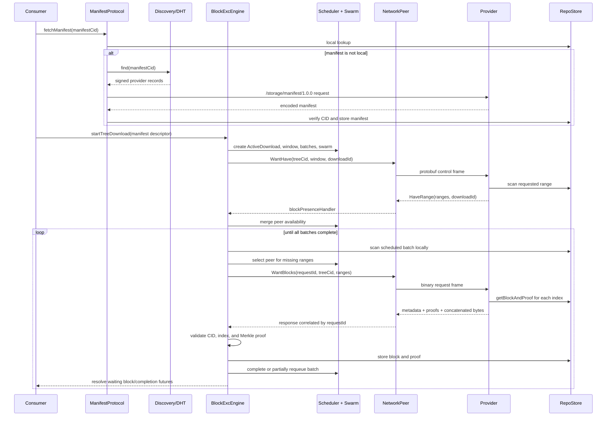

---
tags:
  - logos-storage/block-exchange
  - logos-storage/libp2p
  - libp2p
related:
  - "[[Libp2p connections - connect vs dial]]"
  - "[[Closing libp2p connections and streams]]"
  - "[[Uploading and downloading content in new Logos Storage]]"
  - "[[New Logos Storage Download Flow]]"
  - "[[Block Exchange Peer Performance and BDP]]"
  - "[[Libp2p Connection Lifecycle in Logos Storage]]"
  - "[[New Logos Storage Discovery]]"
  - "[[Block Exchange Peer Stores]]"
---

# New Logos Storage Block Exchange Protocol

> [!info] Source baseline
> This note describes `logos-storage-nim` `master` at commit `81f0d053` (2026-07-20). The block exchange rewrite entered the repository in `bb6ab1be` ("Block exchange protocol rewrite").

Logos Storage block exchange is built on top of [[libp2p]].

To understand how the Logos Storage Block Exchange protocol is built on top of libp2p (the Logos Storage protocol for short), it is useful to first grasp how application protocols are generally implemented on top of libp2p. The [simple ping tutorial](https://vacp2p.github.io/nim-libp2p/docs/tutorial_1_connect/), [custom protocol tutorial](https://vacp2p.github.io/nim-libp2p/docs/tutorial_2_customproto/), [Protobuf tutorial](https://vacp2p.github.io/nim-libp2p/docs/tutorial_3_protobuf/), and introduction to the [Switch](https://docs.libp2p.io/concepts/multiplex/switch/) give useful background. This section summarizes the same concepts and then finds their direct analogues in Logos Storage.

## A minimal protocol on libp2p

Starting a P2P node with a custom protocol can be described in five steps:

1. derive an application protocol from `LPProtocol`;
2. give the protocol a codec and an incoming-stream handler;
3. build a libp2p `Switch`;
4. mount the protocol and start the switch;
5. dial the codec from another peer and exchange data over the negotiated
   stream.

### 1. Derive a protocol from `LPProtocol`

For example, a minimal test protocol can be declared as:

```nim
const TestCodec = "/test/proto/1.0.0"

type TestProto = ref object of LPProtocol
```

The important part is the inheritance from `LPProtocol`. In the current vendored nim-libp2p, the base type stores the codecs and the handler invoked by the protocol negotiator:

```nim
type
  LPProtoHandler* = proc(stream: Stream, proto: string): Future[void] {.
    async: (raises: [CancelledError])
  .}

  LPProtocol* = ref object of RootObj
    started*: bool
    codecs*: seq[string]
    handlerImpl: LPProtoHandler ## invoked by the protocol negotiator
    maxIncomingStreamsTotal: Opt[int]
    maxIncomingStreamsPerPeer: Opt[int]
    maxOutgoingStreamsTotal: Opt[int]
    maxOutgoingStreamsPerPeer: Opt[int]
    streamBudget: StreamBudgetState
      ## Runtime counters shared across all codecs of this protocol
```

An `LPProtocol` is therefore not a socket and not a connection to one peer. It is an application-protocol definition that tells the switch which codec names it accepts and what to do with each incoming negotiated stream.

### 2. Supply the codec and incoming handler

A small illustrative constructor looks like this:

```nim
proc new(T: typedesc[TestProto]): T =
  proc handle(conn: Connection, proto: string) {.async.} =
    echo "Got from remote - ", string.fromBytes(await conn.readLp(1024))
    await conn.close()

  return T.new(codecs = @[TestCodec], handler = handle)
```

Every remote peer that successfully negotiates `TestCodec` causes `handle` to run with a libp2p `Connection`. At this level, `Connection` is the application-facing stream. It normally sits on a multiplexed secure peer connection rather than corresponding one-to-one with a TCP socket.

The current `LPProtocol.new` makes the same contract explicit:

```nim
proc new*(
    T: type LPProtocol,
    codecs: seq[string],
    handler: LPProtoHandler,
    maxIncomingStreamsTotal: Opt[int] | int = Opt.none(int),
    maxIncomingStreamsPerPeer: Opt[int] | int = Opt.none(int),
    maxOutgoingStreamsTotal: Opt[int] | int = Opt.none(int),
    maxOutgoingStreamsPerPeer: Opt[int] | int = Opt.none(int),
): T =
  doAssert(codecs.len > 0, "codecs sequence must not be empty")
  doAssert(not handler.isNil, "handler must be set")

  var proto = T(
    codecs: codecs,
    handlerImpl: handler,
    maxIncomingStreamsTotal: toOpt(maxIncomingStreamsTotal),
    maxIncomingStreamsPerPeer: toOpt(maxIncomingStreamsPerPeer),
    maxOutgoingStreamsTotal: toOpt(maxOutgoingStreamsTotal),
    maxOutgoingStreamsPerPeer: toOpt(maxOutgoingStreamsPerPeer),
  )
```

### 3. Build a switch

The switch ties transports, encryption, stream multiplexing, peer identity, connection management, and protocol negotiation together. A minimal modern switch using the same major components as Logos Storage might look like:

```nim
proc createSwitch(
    ma: MultiAddress, privateKey: PrivateKey, rng: ref HmacDrbgContext
): Switch =
  SwitchBuilder
    .new()
    .withPrivateKey(privateKey)
    .withAddresses(@[ma])
    .withRng(rng)
    .withNoise()
    .withYamux()
    .withTcpTransport()
    .build()
```

Noise secures and authenticates the peer connection. Yamux lets many application streams coexist over that connection. This distinction is why opening a block-exchange stream does not normally require a separate TCP connection.

### 4. Mount and start the protocol

Mounting registers the protocol's codecs and handler with the switch:

```nim
let
  testProto = TestProto.new()
  switch1 = createSwitch(localAddress, privateKey1, rng)

switch1.mount(testProto)
await switch1.start()
```

`mount` makes the protocol negotiable. `start` starts the transports and begins accepting peer connections. Neither operation itself opens an outgoing stream to another peer.

### 5. Dial the protocol

Another switch can establish connectivity and negotiate a protocol stream:

```nim
let conn =
  await switch2.dial(
    switch1.peerInfo.peerId,
    switch1.peerInfo.addrs,
    TestCodec,
  )

await conn.writeLp("hello".toBytes())
await conn.close()
```

The libp2p API distinguishes establishing peer connectivity from opening an application stream:

```nim
method connect*(
    s: Switch,
    peerId: PeerId,
    addrs: seq[MultiAddress],
    forceDial = false,
    reuseConnection = true,
    dir = Direction.Out,
): Future[void] {.async: (raises: [DialFailedError, CancelledError], raw: true).} =
  ## Connects to a peer without opening a stream to it

  s.dialer.connect(peerId, addrs, forceDial, reuseConnection, dir)

method dial*(
    s: Switch, peerId: PeerId, protos: seq[string]
): Future[Stream] {.async: (raises: [DialFailedError, CancelledError], raw: true).} =
  ## Open a stream to a connected peer with the specified `protos`

  s.dialer.dial(peerId, protos)
```

This becomes important in Logos Storage: discovery first calls `connect`, while the block-exchange `NetworkPeer` lazily calls `dial` when it actually needs its application stream.

## The analogous steps in Logos Storage

The executable performs the same high-level sequence as the minimal example: load or create a libp2p identity, construct the server, and start it.

```nim
let
  keyPath =
    if isAbsolute(config.netPrivKeyFile):
      config.netPrivKeyFile
    else:
      config.dataDir / config.netPrivKeyFile

  privateKey = setupKey(keyPath).valueOr:
    fatal "Failed to set up the network private key", path = keyPath, err = error.msg
    quit QuitFailure

  server =
    try:
      StorageServer.new(config, privateKey, logFile)
    except Exception as exc:
      error "Failed to start Logos Storage", msg = exc.msg
      quit QuitFailure
```

Later, the server is started:

```nim
try:
  waitFor server.start()
except CatchableError as error:
  error "Logos Storage failed to start", error = error.msg
  quit QuitFailure
```

### Logos Storage builds the switch

`StorageServer.new` in `storage/storage.nim` constructs the real switch. This is the application counterpart of `createSwitch` above:

```nim
let switch = SwitchBuilder
  .new()
  .withPrivateKey(privateKey)
  .withAddresses(@[listenMultiAddr])
  .withWildcardResolver(true)
  .withIdentifyPusher(false)
  .withRng(random.Rng.instance().libp2pRng)
  .withNoise()
  .withYamux()
  .withMaxConnections(config.maxPeers)
  .withAgentVersion(config.agentString)
  .withSignedPeerRecord(true)
  .withTcpTransport({ServerFlags.ReuseAddr, ServerFlags.TcpNoDelay})
  .build()
```

Compared with the minimal switch, this also supplies the node identity, connection limit, signed peer record, agent version, wildcard-address resolution, and TCP options.

### Logos Storage creates and mounts its protocols

In the same constructor, Logos Storage creates both block exchange and the separate manifest-transfer protocol:

```nim
let
  discovery = Discovery.new(
    switch.peerInfo.privateKey,
    announceAddrs = @[listenMultiAddr],
    bindPort = config.discoveryPort,
    bootstrapNodes = bootstrapNodes,
    dhtMixProxies = config.dhtMixProxies,
    store = discoveryStore,
  )

  network = BlockExcNetwork.new(switch)
```

After the store and engine are constructed, the manifest protocol is created and both protocols are mounted:

```nim
let
  store = NetworkStore.new(engine, repoStore)
  manifestProto = ManifestProtocol.new(switch, repoStore, discovery)

switch.mount(network)
switch.mount(manifestProto)
```

The server start path then starts the repository, maintenance, and switch:

```nim
proc start*(s: StorageServer) {.async.} =
  if s.isStarted:
    warn "Storage server already started, skipping"
    return

  trace "Starting Storage node", config = $s.config
  await s.repoStore.start()
  s.maintenance.start()
  await s.storageNode.switch.start()
```

Thus the two mounted application protocols are:

| Protocol type | Codec | Purpose |
| --- | --- | --- |
| `BlockExcNetwork` | `/storage/blockexc/1.0.0` | Long-lived bidirectional control messages and block batches |
| `ManifestProtocol` | `/storage/manifest/1.0.0` | One manifest request/response per short-lived stream |

Provider discovery is adjacent infrastructure, not a mounted block-transfer protocol. It locates peers by manifest CID before the application protocols exchange data.

### `BlockExcNetwork` is the Logos Storage `LPProtocol`

The analogy with `TestProto` is direct:

```nim
const
  Codec* = "/storage/blockexc/1.0.0"
  DefaultMaxInflight* = 100

type
  BlockExcNetwork* = ref object of LPProtocol
    peers*: Table[PeerId, NetworkPeer]
    excludedPeers: HashSet[PeerId]
    switch*: Switch
    handlers*: BlockExcHandlers
    request*: BlockExcRequest
    getConn: ConnProvider
    inflightSema: AsyncSemaphore
    maxInflight: int = DefaultMaxInflight
    trackedFutures*: TrackedFutures = TrackedFutures()
```

In addition to the inherited codec and handler, it stores:

- the switch used to connect and dial;
- one application-level `NetworkPeer` per connected protocol peer;
- callbacks into the block-exchange engine;
- functions used by the engine to send wants and presence;
- limits and tracked asynchronous work.

The constructor calls the generic `LPProtocol.new` with the block-exchange codec:

```nim
let self = lp_protocol.new(
  BlockExcNetwork, @[Codec], nullHander, maxIncomingStreamsTotal = maxInflight
)
self.switch = switch
self.getConn = connProvider
self.inflightSema = newAsyncSemaphore(max(maxInflight, 1))

self.request = BlockExcRequest(
  sendWantList: sendWantList,
  sendPresence: sendPresence,
)

self.init()
return self
```

`nullHander` only satisfies the base constructor's non-nil handler requirement.
`init` immediately replaces it with the real handler.

### The protocol handler accepts incoming streams

`BlockExcNetwork.init` installs peer join/leave callbacks and the familiar incoming protocol handler:

```nim
method init*(self: BlockExcNetwork) {.raises: [].} =
  proc peerEventHandler(
      peerId: PeerId, event: PeerEvent
  ): Future[void] {.async: (raises: [CancelledError]).} =
    if event.kind == PeerEventKind.Joined:
      await self.handlePeerJoined(peerId)
    elif event.kind == PeerEventKind.Left:
      await self.handlePeerDeparted(peerId)
    else:
      warn "Unknown peer event", event

  self.switch.addPeerEventHandler(peerEventHandler, PeerEventKind.Joined)
  self.switch.addPeerEventHandler(peerEventHandler, PeerEventKind.Left)

  proc handler(
      conn: Connection, proto: string
  ): Future[void] {.async: (raises: [CancelledError]).} =
    let peerId = conn.peerId
    let blockexcPeer = self.getOrCreatePeer(peerId)
    await blockexcPeer.readLoop(conn) # attach read loop

  self.handler = handler
```

This is the same pattern as the small `TestProto`: libp2p negotiates the codec, then calls the handler with the stream. Logos Storage does not process the stream directly in the closure. It maps the remote peer ID to a `NetworkPeer` and delegates the whole stream lifetime to `NetworkPeer.readLoop`.

### `NetworkPeer` is the per-peer application abstraction

`getOrCreatePeer` is where the protocol connects libp2p's stream-oriented API
to Logos Storage's persistent application peer:

```nim
proc getOrCreatePeer(self: BlockExcNetwork, peer: PeerId): NetworkPeer =
  if peer in self.peers:
    return self.peers.getOrDefault(peer, nil)

  var getConn: ConnProvider = proc(): Future[Connection] {.
      async: (raises: [CancelledError])
  .} =
    try:
      trace "Getting new connection stream", peer
      return await self.switch.dial(peer, Codec)
    except CancelledError as error:
      raise error
    except CatchableError as exc:
      trace "Unable to connect to blockexc peer", exc = exc.msg

  if not isNil(self.getConn):
    getConn = self.getConn

  let rpcHandler = proc(p: NetworkPeer, msg: Message) {.async: (raises: []).} =
    await self.rpcHandler(p, msg)

  let wantBlocksHandler = proc(
      peerId: PeerId, req: WantBlocksRequest
  ): Future[seq[BlockDelivery]] {.async: (raises: [CancelledError]).} =
    return await self.handlers.onWantBlocksRequest(peerId, req)

  let blockExcPeer =
    NetworkPeer.new(peer, getConn, rpcHandler, wantBlocksHandler)

  self.peers[peer] = blockExcPeer
  return blockExcPeer
```

Here we recognize the familiar `switch.dial(peer, Codec)`. The resulting `Connection` is a negotiated `/storage/blockexc/1.0.0` stream. It is obtained lazily and retained by `NetworkPeer`, while `BlockExcNetwork.peers` retains the application peer object.

The stored state is:

```nim
type
  NetworkPeer* = ref object of RootObj
    id*: PeerId
    handler*: RPCHandler
    wantBlocksHandler*: WantBlocksRequestHandler
    sendConn: Connection
    getConn: ConnProvider
    yieldInterval*: Duration = DefaultYieldInterval
    trackedFutures: TrackedFutures
    pendingWantBlocksRequests*: Table[uint64, WantBlocksResponseFuture]
    nextRequestId*: uint64
```

This is more than a wrapper around a peer ID. It owns the reusable outbound stream, the read-loop task, the next binary request ID, and all futures waiting for correlated `WantBlocks` responses.

### The read loop replaces the minimal `readLp`

The original protocol could read one length-prefixed message. The new protocol keeps the stream open and multiplexes three application frame types over it:

```nim
proc readLoop*(self: NetworkPeer, conn: Connection) {.async: (raises: []).} =
  if isNil(conn):
    trace "No connection to read from", peer = self.id
    return

  try:
    var nextYield = Moment.now() + self.yieldInterval
    while not conn.atEof and not conn.closed:
      if Moment.now() > nextYield:
        nextYield = Moment.now() + self.yieldInterval
        await sleepAsync(10.millis)

      var lenBuf: array[4, byte]
      await conn.readExactly(addr lenBuf[0], 4)
      let frameLen = uint32.fromBytes(lenBuf, littleEndian).int

      if frameLen < 1:
        warn "Frame too short", peer = self.id, frameLen = frameLen
        return

      var typeByte: array[1, byte]
      await conn.readExactly(addr typeByte[0], 1)

      if typeByte[0] > ord(high(MessageType)):
        warn "Invalid message type byte", peer = self.id, typeByte = typeByte[0]
        return

      let
        msgType = MessageType(typeByte[0])
        dataLen = frameLen - 1

      case msgType
      of mtProtobuf:
        if dataLen > MaxMessageSize.int:
          warn "Protobuf message too large", peer = self.id, size = dataLen
          return

        var data = newSeq[byte](dataLen)
        if dataLen > 0:
          await conn.readExactly(addr data[0], dataLen)

        let msg = Message.decode(data).mapFailure().tryGet()
        await self.handler(self, msg)
      of mtWantBlocksRequest:
        let reqResult = await readWantBlocksRequest(conn, dataLen)
        if reqResult.isErr:
          warn "Failed to read WantBlocks request",
            peer = self.id, error = reqResult.error.msg
          return

        let
          req = reqResult.get
          blocks = await self.wantBlocksHandler(self.id, req)
        await writeWantBlocksResponse(conn, req.requestId, req.treeCid, blocks)
      of mtWantBlocksResponse:
        let respResult = await readWantBlocksResponse(conn, dataLen)
        if respResult.isErr:
          warn "Failed to read WantBlocks response",
            peer = self.id, error = respResult.error.msg
          return

        let response = respResult.get
        self.pendingWantBlocksRequests.withValue(response.requestId, fut):
          if not fut[].finished:
            fut[].complete(WantBlocksResult[WantBlocksResponse].ok(response))
          self.pendingWantBlocksRequests.del(response.requestId)
        do:
          warn "Received WantBlocks response for unknown request ID",
            peer = self.id, requestId = response.requestId
  except CancelledError:
    trace "Read loop cancelled"
  except CatchableError as err:
    warn "Exception in blockexc read loop", msg = err.msg
```

The loop illustrates a major difference from the older protocol. Protobuf now carries only wants and presence. Binary `WantBlocks` requests and responses travel as their own frame types and are correlated by `requestId`.

The `finally` block defines stream disposal and pending-request failure:

```nim
finally:
  warn "Detaching read loop", peer = self.id, connId = conn.oid
  for requestId, fut in self.pendingWantBlocksRequests:
    if not fut.finished:
      fut.complete(
        WantBlocksResult[WantBlocksResponse].err(
          wantBlocksError(ConnectionClosed, "Read loop exited")
        )
      )
  self.pendingWantBlocksRequests.clear()
  if self.sendConn == conn:
    self.sendConn = nil
  await conn.close()
```

### Protobuf messages are forwarded to the engine

For a Protobuf control frame, `readLoop` calls the `rpcHandler` closure supplied
by `getOrCreatePeer`. That reaches `BlockExcNetwork.rpcHandler`:

```nim
proc rpcHandler(
    self: BlockExcNetwork, peer: NetworkPeer, msg: Message
) {.async: (raises: []).} =
  if msg.wantList.entries.len > 0:
    self.trackedFutures.track(self.handleWantList(peer, msg.wantList))

  if msg.blockPresences.len > 0:
    self.trackedFutures.track(self.handleBlockPresence(peer, msg.blockPresences))
```

The network layer deliberately does not implement scheduling or storage. Its small forwarding functions call callbacks installed by `BlockExcEngine`:

```nim
proc handleWantList(
    b: BlockExcNetwork, peer: NetworkPeer, list: WantList
) {.async: (raises: []).} =
  if not b.handlers.onWantList.isNil:
    await b.handlers.onWantList(peer.id, list)

proc handleBlockPresence(
    b: BlockExcNetwork, peer: NetworkPeer, presence: seq[BlockPresence]
) {.async: (raises: []).} =
  if not b.handlers.onPresence.isNil:
    await b.handlers.onPresence(peer.id, presence)
```

`BlockExcEngine.new` supplies the concrete application callbacks:

```nim
proc blockWantListHandler(
    peer: PeerId, wantList: WantList
): Future[void] {.async: (raises: []).} =
  self.wantListHandler(peer, wantList)

proc blockPresenceHandler(
    peer: PeerId, presence: seq[BlockPresence]
): Future[void] {.async: (raises: []).} =
  self.blockPresenceHandler(peer, presence)

proc wantBlocksRequestHandler(
    peer: PeerId, req: WantBlocksRequest
): Future[seq[BlockDelivery]] {.async: (raises: [CancelledError]).} =
  let maxIndex = high(Natural).uint64
  var totalCount: uint64 = 0
  for r in req.ranges:
    if r.count == 0 or r.start > maxIndex or r.count - 1 > maxIndex - r.start or
        r.start > uint64.high - r.count or r.count > uint64.high - totalCount:
      warn "Rejecting WantBlocks request: invalid range",
        peer = peer, start = r.start, count = r.count
      return @[]
    totalCount += r.count
    if totalCount > MaxBlocksPerBatch:
      warn "Rejecting WantBlocks request: total blocks exceeds cap",
        peer = peer, total = totalCount
      return @[]

  var
    blockDeliveries: seq[BlockDelivery]
    notFoundCount = 0
    totalRequested: uint64 = 0

  for r in req.ranges:
    totalRequested += r.count
    for i in r.start ..< r.start + r.count:
      let address = BlockAddress(treeCid: req.treeCid, index: i)

      let res = await self.localLookup(address)
      if res.isOk:
        blockDeliveries.add(res.get)
      else:
        notFoundCount += 1

  storage_block_exchange_blocks_sent.inc(blockDeliveries.len.int64)
  return blockDeliveries

network.handlers = BlockExcHandlers(
  onWantList: blockWantListHandler,
  onPresence: blockPresenceHandler,
  onWantBlocksRequest: wantBlocksRequestHandler,
  onPeerJoined: peerAddedHandler,
  onPeerDeparted: peerDepartedHandler,
)
```

The complete path for a control message is therefore:

```text
libp2p protocol negotiation
  -> BlockExcNetwork.handler(Connection)
  -> NetworkPeer.readLoop
  -> decode Message
  -> BlockExcNetwork.rpcHandler
  -> BlockExcHandlers callback
  -> BlockExcEngine.wantListHandler / blockPresenceHandler
```

For binary block requests, the read loop calls
`wantBlocksRequestHandler` directly and writes the response on the same stream.
For binary responses, the read loop resolves the future stored under the
matching request ID.

## What the new protocol adds

With the classical libp2p structure established, the rest of this note follows the current block-exchange behavior in detail. Its purpose is to retrieve the content blocks of a dataset from one or more peers, validate them, store them locally, and make them available to the consumer in dataset order.

The current design is substantially different from the protocol documented in [[Codex Block Exchange Protocol]]:

- `WantHave` is now the only control-message want type.
- Control messages describe block availability over ranges.
- Block bytes are requested with a separate binary `WantBlocks` request and returned as a batch.
- Scheduling state is local to an `ActiveDownload`.
- Every download has its own peer `Swarm`, block scheduler, retry state, and `downloadId`.
- A peer can serve several outstanding batch requests. The allowed pipeline depth is adapted from measured RTT and throughput.
- A manifest is no longer fetched as an ordinary block-exchange block. It has a separate libp2p protocol, `/storage/manifest/1.0.0`.
- Only manifest CIDs are advertised through provider discovery. Once a manifest provider is connected, block availability is learned through block-exchange presence messages.

The term "block exchange" below refers specifically to `/storage/blockexc/1.0.0`. Manifest transfer and provider discovery are adjacent protocols needed for a complete download, but they are not block-data transfer messages.

## The main components

| Component | Responsibility |
| --- | --- |
| `BlockExcNetwork` | Mounts `/storage/blockexc/1.0.0`, tracks connected protocol peers, frames messages, and dispatches incoming control and block requests. |
| `NetworkPeer` | Owns/reuses a block-exchange stream to one peer, runs its read loop, allocates request IDs, and correlates block responses with pending requests. |
| `BlockExcEngine` | Coordinates downloads, presence queries, peer discovery, peer selection, batch transfer, validation, storage, retries, and failure handling. |
| `DownloadManager` | Creates and indexes independent `ActiveDownload` instances by tree CID and `downloadId`. |
| `ActiveDownload` | Holds per-download block futures, batches in flight, retry counters, cancellation state, and completion. |
| `DownloadContext` | Holds the manifest descriptor, scheduler, per-download swarm, transfer counters, and availability-broadcast state. |
| `Scheduler` | Splits a dataset into batches, chooses sequential or randomized windows, tracks in-flight/completed work, and requeues missing ranges. |
| `Swarm` | Tracks which peers have which ranges, peer health, failures/timeouts, and candidate selection for each batch. |
| `PeerContext` / `PeerPerfStats` | Stores connection-wide performance observations used for BDP-aware pipelining and timeouts. |
| `DiscoveryEngine` | Finds providers of the manifest CID and asks `BlockExcNetwork` to connect to them. |
| `Advertiser` | Advertises locally stored manifest CIDs through the discovery service. |
| `ManifestProtocol` | Discovers and fetches the manifest before a dataset download starts. |
| `NetworkStore` | Presents local storage plus active-download block futures to consumers such as `StoreStream`. |

The construction happens in `storage/storage.nim`:

```text
Switch
  ├── BlockExcNetwork              /storage/blockexc/1.0.0
  ├── ManifestProtocol             /storage/manifest/1.0.0
  ├── discovery / DHT
  └── optional MIX + DHT proxy

RepoStore
  ├── Advertiser
  ├── DiscoveryEngine
  ├── BlockExcEngine
  │     └── DownloadManager
  └── NetworkStore
```

`BlockExcNetwork` and `ManifestProtocol` are both mounted on the same libp2p switch, but they negotiate separate protocol streams.

## Dataset identity and block addressing

An uploaded dataset has three related identifiers:

1. **Block CID** — the content-addressed CID of one data block.
2. **Tree CID** — the Merkle root of the ordered block-CID leaves.
3. **Manifest CID** — the CID of the encoded manifest containing the tree CID, block size, dataset size, codecs, and optional file metadata.

Block exchange does not request data by block CID alone. It uses:

```nim
BlockAddress(treeCid: Cid, index: uint64)
```

This lets the receiver verify both:

- the block data matches the returned block CID; and
- the block CID at that index belongs to the requested Merkle tree.

The manifest tells the downloader the `treeCid`, `blockSize`, and `blocksCount` needed to create the complete address range.

The corresponding source types make that mapping concrete:

```nim
type
  Block* = ref object of RootObj
    cid*: Cid
    data*: ref seq[byte]

  BlockAddress* {.proto2.} = object
    treeCid* {.serialize, fieldNumber: 1, required, ext.}: Cid
    index* {.serialize, fieldNumber: 2, required, pint.}: uint64

proc init*(_: type BlockAddress, treeCid: Cid, index: uint64): BlockAddress =
  BlockAddress(treeCid: treeCid, index: index)
```

The manifest is the bridge from the manifest CID known by the API and
discovery layer to the tree-relative addresses used by block exchange:

```nim
type ManifestDescriptor* = ref object
  manifest*: Manifest
  manifestCid*: Cid

func blocksCount*(self: Manifest): int =
  divUp(self.datasetSize.int, self.blockSize.int)

func treeCid*(self: Manifest): Cid =
  self.treeCid

func blockSize*(self: Manifest): NBytes =
  self.blockSize
```

## Connections and protocol mounting

`BlockExcNetwork` derives from libp2p's `LPProtocol` and advertises:

```text
/storage/blockexc/1.0.0
```

For an incoming negotiated stream, the protocol handler:

1. reads `conn.peerId`;
2. obtains or creates a `NetworkPeer`;
3. attaches `NetworkPeer.readLoop` to the stream.

For outgoing traffic, `NetworkPeer.connect` dials the same codec and retains the resulting stream as `sendConn`. That stream is reused until it closes or fails. The read loop also runs on the outbound stream, so requests and responses can travel in both directions.

Peer join/leave events are propagated to the engine:

- join creates a `PeerContext`;
- departure removes the peer from the global peer store and clears its in-flight performance tracking;
- configured MIX relay peers are explicitly excluded from block-exchange peer handling.

## Wire framing

Every block-exchange frame starts with:

```text
+----------------------+----------------------+-------------------+
| frame length         | message type         | payload           |
| uint32 little-endian | uint8                | frameLen - 1 bytes|
+----------------------+----------------------+-------------------+
```

The message types are:

| Value | Type | Encoding | Purpose |
| ---: | --- | --- | --- |
| `0x00` | `mtProtobuf` | Protobuf | `WantList` and `BlockPresence` control messages |
| `0x01` | `mtWantBlocksRequest` | Custom binary | Request one or more index ranges from one tree |
| `0x02` | `mtWantBlocksResponse` | Custom binary | Return metadata, Merkle proofs, and concatenated block bytes |

The framing lets one long-lived stream carry control traffic and multiple correlated block requests/responses.

### Control message

The Protobuf `Message` contains:

```text
Message
  wantList:
    entries[]:
      address        BlockAddress
      priority       int32
      cancel         bool
      wantType       WantHave
      sendDontHave   bool
      rangeCount     uint64
      downloadId     uint64
    full             bool

  blockPresences[]:
    address          BlockAddress
    kind             DontHave | HaveRange | Complete
    ranges[]         (start, count)
    downloadId       uint64
```

`rangeCount == 0` means a single-address availability query. A positive value asks about the consecutive range beginning at `address.index`.

`downloadId` is essential because several downloads for the same tree CID may coexist. Presence responses are first applied to the matching download and may then be propagated to other active downloads of the same tree.

The current engine sends `sendDontHave = false`, so a peer normally stays silent when it has none of the requested range. The wire format still supports explicit `DontHave`.

These fields are not merely a conceptual schema; they are the Protobuf types
decoded by `NetworkPeer.readLoop`:

```nim
type
  WantListEntry* {.proto2.} = object
    address* {.fieldNumber: 1, required.}: BlockAddress
    priority* {.fieldNumber: 2, required, pint.}: int32
    cancel* {.fieldNumber: 3, required.}: bool
    wantType* {.fieldNumber: 4, required, ext.}: WantType
    sendDontHave* {.fieldNumber: 5, required.}: bool
    rangeCount* {.fieldNumber: 6, required, pint.}: uint64
    downloadId* {.fieldNumber: 7, required, pint.}: uint64

  WantList* {.proto2.} = object
    entries* {.fieldNumber: 1.}: seq[WantListEntry]
    full* {.fieldNumber: 2, required.}: bool

  BlockPresenceType* {.pure.} = enum
    DontHave = 0
    HaveRange = 1
    Complete = 2

  IndexRange* {.proto2.} = object
    start* {.fieldNumber: 1, required, pint.}: uint64
    count* {.fieldNumber: 2, required, pint.}: uint64

  BlockPresence* {.proto2.} = object
    address* {.fieldNumber: 1, required.}: BlockAddress
    kind* {.fieldNumber: 2, required, ext.}: BlockPresenceType
    ranges* {.fieldNumber: 3.}: seq[IndexRange]
    downloadId* {.fieldNumber: 4, required, pint.}: uint64

  Message* {.proto2.} = object
    wantList* {.fieldNumber: 1, required.}: WantList
    blockPresences* {.fieldNumber: 4.}: seq[BlockPresence]
```

The network helper builds the wire message from engine-level arguments:

```nim
proc sendWantList*(
    b: BlockExcNetwork,
    id: PeerId,
    addresses: seq[BlockAddress],
    priority: int32 = 0,
    cancel: bool = false,
    wantType: WantType = WantType.WantHave,
    full: bool = false,
    sendDontHave: bool = false,
    rangeCount: uint64 = 0,
    downloadId: uint64 = 0,
) {.async: (raw: true, raises: [CancelledError]).} =
  let msg = WantList(
    entries: addresses.mapIt(
      WantListEntry(
        address: it,
        priority: priority,
        cancel: cancel,
        wantType: wantType,
        sendDontHave: sendDontHave,
        rangeCount: rangeCount,
        downloadId: downloadId,
      )
    ),
    full: full,
  )

  b.send(id, Message(wantlist: msg))
```

### WantBlocks request

A block request contains:

```text
requestId : uint64
treeCid   : length-prefixed CID
ranges[]  : (start: uint64, count: uint64)
```

The downloader first scans a scheduled batch locally. Only missing indices are coalesced into contiguous ranges, so it does not ask a peer for blocks it already has.

The serving peer validates all ranges before doing store work:

- count must be non-zero;
- `start + count` must not overflow;
- indices must fit `Natural`;
- the combined number of requested blocks must not exceed `MaxBlocksPerBatch`.

It then calls `localStore.getBlockAndProof(treeCid, index)` for each requested index. Missing blocks are omitted, so a successful response may be partial or empty.

On the requesting side, one future is installed before the frame is written.
That ordering ensures a fast response cannot arrive before its correlation
state exists:

```nim
proc sendWantBlocksRequest*(
    self: NetworkPeer, blockRange: BlockRange
): Future[WantBlocksResult[WantBlocksResponse]] {.async: (raises: [CancelledError]).} =
  let requestId = self.nextRequestId
  self.nextRequestId += 1

  let responseFuture = WantBlocksResponseFuture.init("wantBlocksRequest")
  self.pendingWantBlocksRequests[requestId] = responseFuture

  try:
    let conn = await self.connect()
    if isNil(conn):
      self.pendingWantBlocksRequests.del(requestId)
      return err(wantBlocksError(NoConnection, "No connection available"))

    let req = WantBlocksRequest(
      requestId: requestId, treeCid: blockRange.treeCid, ranges: blockRange.ranges
    )
    await writeWantBlocksRequest(conn, req)
    return await responseFuture
  except CancelledError as exc:
    self.pendingWantBlocksRequests.del(requestId)
    raise exc
  except CatchableError as err:
    self.pendingWantBlocksRequests.del(requestId)
    return err(wantBlocksError(RequestFailed, "WantBlocks request failed: " & err.msg))
```

### WantBlocks response

A response contains:

```text
requestId
treeCid
blockCount

for each block:
  index
  block CID
  data length
  Merkle proof

all block byte strings concatenated after the metadata
```

The receiver reads all block bytes once into a shared buffer. Each `BlockDeliveryView` points at an offset and length in that buffer, avoiding an immediate copy before validation. A concrete `BlockDelivery` is allocated only for accepted data that will be stored.

`NetworkPeer.pendingWantBlocksRequests` maps `requestId` to a future. A response completes the matching future. An unknown request ID is logged and ignored. If the read loop exits, all outstanding response futures fail with `ConnectionClosed`.

## Size and work limits

The implementation bounds both bytes and work:

| Limit | Current value |
| --- | ---: |
| Protobuf control payload | 16 MiB |
| Entries in one want list | 1,024 |
| Presence entries in one message | 1,024 |
| Target data per block batch | 1 MiB |
| Response metadata | 4 MiB |
| Response content | metadata limit + about 1 MiB data |
| Merkle proof depth | 64 |
| Block size | 4 KiB–512 KiB, power of two |
| Presence window | 1 GiB of dataset space |

The batch block count is approximately:

```text
batch blocks = clamp(1 MiB / manifest.blockSize, at least 1, response-size cap)
```

With the default 64 KiB block size, a normal batch contains 16 blocks.

Range-presence handling also has an iteration budget. Oversized ranges are rejected and a handler periodically yields to the async runtime while scanning local storage.

## Starting a download

A dataset download starts only after a manifest has been obtained and decoded. The manifest is wrapped in:

This section describes the main state. For a line-by-line call chain from
`startTreeDownloadOpaque` through `downloadWorker`, presence exchange,
`sendWantBlocksRequest`, and creation or reuse of the outgoing application
stream, see [[New Logos Storage Download Flow]].

```nim
ManifestDescriptor(
  manifest: manifest,
  manifestCid: cid
)
```

`BlockExcEngine.startTreeDownload` or `startTreeDownloadOpaque` creates:

- a new `downloadId`;
- an `ActiveDownload`;
- a `DownloadContext`;
- a scheduler covering the dataset's block indices;
- an initially empty per-download swarm;
- per-block futures that consumers can await.

Two download modes expose the same engine:

- `DownloadHandle[Block]` yields block data through an async iterator;
- `DownloadHandle[void]` only reports completion and is used for prefetch/background downloads and streaming via `NetworkStore`.

Multiple downloads for the same tree CID are independent. Releasing or cancelling one does not cancel the others.

The generic implementation shows how the manifest becomes an
`ActiveDownload` and how ordered consumer requests become per-address handles:

```nim
proc startTreeDownloadGeneric[T: Block | void](
    self: BlockExcEngine,
    md: ManifestDescriptor,
    selectionPolicy: SelectionPolicy = spSequential,
    isBackground: bool = false,
    fetchLocal: bool = false,
): ?!DownloadHandleGeneric[T] =
  let
    desc = toDownloadDesc(
      md,
      selectionPolicy = selectionPolicy,
      isBackground = isBackground,
      fetchLocal = fetchLocal,
    )
    activeDownload = self.startDownload(desc)
    treeCid = md.manifest.treeCid
    totalBlocks = md.manifest.blocksCount.uint64

  var
    pendingHandle: Option[HandleT] = none(HandleT)
    nextBlockToRequest: uint64 = 0

  proc genNext(): Future[?!T] {.async: (raises: [CancelledError]).} =
    while pendingHandle.isNone and nextBlockToRequest < totalBlocks:
      let address = BlockAddress(treeCid: treeCid, index: nextBlockToRequest)
      nextBlockToRequest += 1

      let handle =
        when T is void:
          activeDownload.getWantHandleOpaque(address)
        else:
          activeDownload.getWantHandle(address)

      when T is void:
        let exists =
          try:
            await address in self.localStore
          except CatchableError:
            false
        if exists:
          discard activeDownload.completeWantHandle(address)
      else:
        let blkResult = await self.localStore.getBlock(address)
        if blkResult.isOk:
          discard activeDownload.completeWantHandle(address, some(blkResult.get))

      pendingHandle = some(handle)
```

## Presence windows and scheduling

It would be expensive to ask every peer about every block of a very large dataset. The scheduler therefore divides the dataset into **presence windows** representing up to 1 GiB of content.

For an ordinary streaming download:

1. scheduling is sequential;
2. the first presence window begins at index 0;
3. when the completed watermark passes 75% of the current window and its work has been issued, the next window opens;
4. old range-presence data below the watermark is trimmed.

For a background network download:

1. the REST API selects `spRandomWindow`;
2. windows are visited in a pseudo-random permutation;
3. this spreads newly acquired availability across the dataset instead of always filling from the beginning.

Inside a window, the scheduler produces roughly 1 MiB batches. It separately tracks:

- newly scheduled batches;
- requeued batches;
- in-flight batches;
- the sequential completion watermark;
- batches completed out of order;
- partially completed parent batches.

## Availability discovery within block exchange

At worker startup, the engine selects up to the swarm's `deltaMax` connected peers (16 by default) and broadcasts `WantHave` for the current presence window.

The receiving peer scans its local block/proof index and returns:

- `HaveRange` with one or more contiguous index ranges;
- `DontHave` only when explicitly requested;
- `Complete` is supported by the protocol and swarm model, although the normal range-query handler produces `HaveRange`.

The requester converts the answer to one of:

```text
Unknown
Complete
Ranges[(start, count), ...]
Bitmap
```

Availability updates are merged by union. The swarm can therefore learn additional ranges over time.

The downloader issues a range query by sending one starting address plus a
count and its own download ID:

```nim
proc broadcastWantHave(
    self: BlockExcEngine,
    download: ActiveDownload,
    start: uint64,
    count: uint64,
    peers: seq[PeerContext],
) {.async: (raises: [CancelledError]).} =
  let rangeAddress = BlockAddress.init(download.treeCid, start)
  for peerCtx in peers:
    if not download.addPeerIfAbsent(peerCtx.id, BlockAvailability.unknown()):
      continue

    try:
      await self.network.request
        .sendWantList(
          peerCtx.id,
          @[rangeAddress],
          priority = 0,
          cancel = false,
          wantType = WantType.WantHave,
          full = false,
          sendDontHave = false,
          rangeCount = count,
          downloadId = download.id,
        )
        .wait(DefaultWantHaveSendTimeout)
    except AsyncTimeoutError:
      warn "Want-have send timed out", peer = peerCtx.id
    except CatchableError as err:
      warn "Want-have send failed", peer = peerCtx.id, error = err.msg
```

The returned wire presence is converted into the per-download availability
model and also propagated to sibling downloads of the same tree:

```nim
proc blockPresenceHandler*(
    self: BlockExcEngine, peer: PeerId, blocks: seq[BlockPresence]
) {.async: (raises: []).} =
  let peerCtx = self.peers.get(peer)
  if peerCtx.isNil:
    return

  for blk in blocks:
    if presence =? Presence.init(blk):
      if presence.have:
        let
          treeCid = presence.address.treeCid
          downloadOpt = self.downloadManager.getDownload(blk.downloadId, treeCid)

        if downloadOpt.isSome:
          let availability =
            case presence.presenceType
            of BlockPresenceType.Complete:
              BlockAvailability.complete()
            of BlockPresenceType.HaveRange:
              if presence.ranges.len > 0:
                BlockAvailability.fromRanges(presence.ranges)
              else:
                BlockAvailability.unknown()
            of BlockPresenceType.DontHave:
              BlockAvailability.unknown()

          downloadOpt.get().updatePeerAvailability(peer, availability)

          self.downloadManager.downloads.withValue(treeCid, innerTable):
            for otherId, otherDownload in innerTable[]:
              if otherId != blk.downloadId:
                otherDownload.updatePeerAvailability(peer, availability)
```

If no known peer covers a scheduled batch, the worker:

1. sends another range `WantHave` to connected peers;
2. briefly waits for replies;
3. re-queries stale peers whose availability is still unknown;
4. triggers provider discovery when swarm health is below target or no useful peer is available;
5. requeues the batch when it still cannot select a peer.

## Provider discovery

Provider discovery is keyed by **manifest CID**, not by every data-block CID or by the tree CID.

For a tutorial covering Discv5 construction, signed provider records,
advertisement, direct and MIX-proxied lookup, and the exact point where
`switch.connect` creates the libp2p peer connection, see
[[New Logos Storage Discovery]].

The provider side:

1. stores a manifest block;
2. `RepoStore.onBlockStored` invokes `Advertiser`;
3. `Advertiser` filters for manifest CIDs;
4. the CID is queued for `Discovery.provide`;
5. the discovery protocol publishes the node's signed peer record;
6. all locally stored manifests are re-advertised periodically (30 minutes by default).

The downloader side:

1. queues `Discovery.find(manifestCid)`;
2. provider signed peer records are returned;
3. `BlockExcNetwork.dialPeer` connects to those peers;
4. libp2p peer-join events create `NetworkPeer` and `PeerContext` state;
5. the download worker asks the new peer about the relevant block range.

`Discovery.find` can use either:

- a direct DHT provider lookup; or
- an optional DHT lookup proxy over MIX when private queries are enabled.

The current block data connection itself is still the ordinary libp2p block-exchange stream. MIX currently protects the provider lookup path, not the `WantBlocks` data transfer.

## Peer selection and adaptive pipelining

For a detailed tutorial on the last-16 request-latency history, rolling
three-second throughput window, BDP-depth estimate, probing controller, and
weighted peer score, see [[Block Exchange Peer Performance and BDP]].

Each download swarm aims for:

| Setting | Default |
| --- | ---: |
| Minimum active peers | 2 |
| Target active peers | 8 |
| Maximum peers | 16 |

For each batch, selection first filters peers by advertised availability:

1. prefer peers covering the complete batch;
2. otherwise allow peers with any overlap, accepting a partial response;
3. remove disconnected candidates;
4. exclude peers whose request pipeline is already full.

Among eligible peers, `selectByBDP` considers:

- current in-flight load versus pipeline capacity;
- measured throughput;
- measured RTT;
- timeout penalties;
- a small exploration probability so untried or potentially improved peers receive work.

The initial pipeline depth is 2 requests per peer. It may adapt between 2 and 32 based on estimated bandwidth-delay product and periodic probes.

Batch timeout is also adaptive:

```text
(estimated transfer time + RTT) × safety factor
```

It is clamped to 5–45 seconds and falls back to 30 seconds before enough measurements exist.

## Receiving and validating a batch

For every returned block, the downloader verifies:

1. its index was actually requested;
2. the index is smaller than `manifest.blocksCount`;
3. a Merkle proof is present;
4. the proof's index matches the returned address;
5. hashing the returned bytes produces the claimed block CID;
6. the proof links that block hash to the requested tree CID.

Only then does it:

1. copy the block out of the shared response buffer;
2. store the block locally;
3. store `(treeCid, index) -> (blockCid, proof)`;
4. complete any consumer future waiting for that address;
5. update download and peer performance counters.

If storing the proof fails after storing the block, the new block is removed to avoid leaving an unusable leaf without its tree mapping.

A peer that sends an out-of-bounds index or corrupt block/proof is banned from that download's swarm and disconnected.

The receive path performs these checks before resolving any consumer future:

```nim
for view in allBlockViews:
  if not bexutils.isIndexInRanges(
    view.address.index.uint64, ranges, sortedRanges = true
  ):
    warn "Received unrequested block", index = view.address.index, ranges = ranges.len
    continue

  if view.address.index.uint64 >= download.ctx.totalBlocks:
    warn "Received block with out-of-bounds index - banning peer",
      index = view.address.index,
      totalBlocks = download.ctx.totalBlocks,
      peer = peer.id
    await self.banAndDropPeer(download, peer.id)
    return

  if err =? self.validateBlockDeliveryView(view).errorOption:
    error "Block validation failed - corrupted data from peer",
      address = view.address, msg = err.msg, peer = peer.id
    await self.banAndDropPeer(download, peer.id)
    return

  let
    bd = view.toBlockDelivery()
    putResult = await self.localStore.putBlock(bd.blk)
  if putResult.isErr:
    warn "Failed to store block", address = bd.address, error = putResult.error.msg
    continue

  let proofResult = await self.localStore.putCidAndProof(
    bd.address.treeCid, bd.address.index, bd.blk.cid, bd.proof.get
  )
  if proofResult.isErr:
    warn "Failed to store proof", address = bd.address
    discard await self.localStore.delBlock(bd.blk.cid)
    continue

  if bd.address in download.blocks:
    discard download.completeWantHandle(bd.address, some(bd.blk))
```

## Partial, empty, failed, and timed-out responses

The protocol deliberately allows a provider to return only the requested blocks it has.

- **Empty response:** requeue the original batch at the back.
- **Partial response:** accept valid blocks, decrement retries for missing blocks the peer claimed to have, split remaining indices into contiguous ranges, and requeue them.
- **Request error:** increment the peer's failure count. Below the failure threshold the batch is requeued immediately; at the threshold the peer is removed and all its in-flight batches are reclaimed.
- **Timeout:** increment the peer timeout count, decrement per-block retries, requeue at the front, and cancel the late request future.
- **Late response after reassignment:** discard it by checking that the pending batch is still assigned to the same peer.
- **Disconnected peer:** remove it from global peer state, clear tracked in-flight counts, and allow batches to be assigned elsewhere.

Defaults are 2 failed requests before removing a peer, 5 timeouts before removing it, and 300 retries per requested block before the download fails with `RetriesExhaustedError`.

## Sharing newly obtained availability

Downloads are not passive consumers. As batches complete, the engine periodically sends `HaveRange` messages to peers in that download's swarm.

For sequential downloads it broadcasts:

- newly advanced contiguous ranges behind the completion watermark; and
- newly completed out-of-order batches.

Broadcasts occur after enough new blocks, after a randomized 5–10 second interval, or immediately for new out-of-order completion. Peers already marked `Complete` are skipped.

This lets two partially complete downloaders exchange different regions without maintaining the old global "peer wants" delivery queue.

## End-to-end sequence



## Important state boundaries

It helps to distinguish four scopes:

| Scope | State |
| --- | --- |
| Node-wide | libp2p switch, discovery, local store, connected `PeerContext`s, peer performance history |
| Per peer connection | negotiated stream, next request ID, pending response futures |
| Per tree | possibly several active downloads indexed under the same tree CID |
| Per download | `downloadId`, scheduler, swarm availability, pending batches, block retries, block futures, cancellation |

In particular, block availability is no longer global peer state. It is primarily maintained in each download's swarm because different downloads may be at different windows and may have asked different questions.

## Code map

| Area | File |
| --- | --- |
| Network protocol and peer events | `storage/blockexchange/network/network.nim` |
| Stream framing and request correlation | `storage/blockexchange/network/networkpeer.nim` |
| Protobuf control schema | `storage/blockexchange/protocol/message.nim` |
| Binary batch schema and codecs | `storage/blockexchange/protocol/wantblocks.nim` |
| Limits | `storage/blockexchange/protocol/constants.nim` |
| Main worker and validation | `storage/blockexchange/engine/engine.nim` |
| Per-download lifecycle | `storage/blockexchange/engine/activedownload.nim` |
| Download construction/indexing | `storage/blockexchange/engine/downloadmanager.nim` |
| Windows and availability broadcasts | `storage/blockexchange/engine/downloadcontext.nim` |
| Batch scheduling | `storage/blockexchange/engine/scheduler.nim` |
| Per-download peer set and selection | `storage/blockexchange/engine/swarm.nim` |
| RTT, throughput, pipeline depth | `storage/blockexchange/peers/peerstats.nim` |
| Manifest advertisement | `storage/blockexchange/engine/advertiser.nim` |
| Provider lookup and dialing | `storage/blockexchange/engine/discovery.nim` |
| Manifest transfer | `storage/manifest/protocol.nim` |
| Local/network store bridge | `storage/stores/networkstore.nim` |

## Pragmatic mental model

The shortest accurate mental model is:

> Discover a provider by manifest CID, fetch the manifest on its own protocol, ask connected peers which ranges of the manifest's tree they have, schedule approximately 1 MiB batches across a small adaptive swarm, request only missing ranges, validate every returned block against both its CID and the tree root, store it, and resolve the consumer's per-block futures.

The protocol's transport-facing requirements are therefore richer than "send a request and get bytes": it expects a bidirectional framed stream, concurrent outstanding request/response correlation, bounded large messages, timely cancellation/failure propagation, peer identity, and performance characteristics that can be measured for adaptive pipelining.
