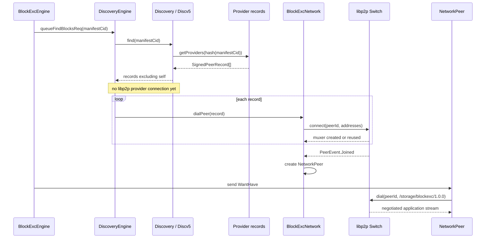

---
tags:
  - logos-storage/discovery
  - logos-storage/block-exchange
  - logos-storage/libp2p
  - logos-storage/mix
related:
  - "[[Libp2p connections - connect vs dial]]"
  - "[[Closing libp2p connections and streams]]"
  - "[[New Logos Storage Block Exchange Protocol]]"
  - "[[New Logos Storage Download Flow]]"
  - "[[Libp2p Connection Lifecycle in Logos Storage]]"
  - "[[Uploading and downloading content in new Logos Storage]]"
---

# New Logos Storage Discovery

> [!info] Source baseline
> This note describes `logos-storage-nim` `master` at commit `81f0d053`
> (2026-07-20), including the current DHT-proxy-over-MIX implementation.

Logos Storage discovery answers a narrow question:

> Given a manifest CID, which signed peer records claim that they can provide
> the corresponding dataset?

Discovery does **not** transfer the manifest or dataset blocks. It produces
peer identities and addresses. Manifest protocol or block exchange then uses
those results to create a libp2p connection and open an application stream.

That boundary is central to understanding the system:

```text
Discv5 provider lookup
  -> SignedPeerRecord(PeerId, libp2p addresses)
  -> no libp2p connection yet

Block-exchange handoff
  -> BlockExcNetwork.dialPeer(record)
  -> Switch.connect(peerId, addresses)
  -> physical secure/multiplexed peer connection is created or reused here
  -> first block-exchange message later calls Switch.dial(codec)

Manifest handoff
  -> ManifestProtocol.fetchManifestFromPeer(record)
  -> Switch.dial(peerId, addresses, manifest codec)
  -> creates/reuses the peer connection and opens a stream in one operation
```

For the lifetime of the resulting muxer and protocol streams, see
[[Libp2p Connection Lifecycle in Logos Storage]].

## The layers involved

The word “discovery” refers to several related components:

| Component | Role |
| --- | --- |
| Discv5 `Protocol` | Maintains the UDP discovery routing table and provider records |
| `Discovery` | Logos Storage wrapper around Discv5; creates signed records and selects direct or private lookup |
| `Advertiser` | Detects locally stored manifests and queues `Discovery.provide` |
| `DiscoveryEngine` | Queues block-exchange provider searches and connects returned peers |
| `ManifestProtocol` | Calls `Discovery.find` directly, then dials a manifest stream |
| `DhtProxyProtocol` | Answers provider queries on behalf of a caller arriving over MIX |
| DHT-proxy client | Turns one provider lookup into a synthetic MIX `Connection` request |

Two networks are therefore involved in the ordinary direct path:

```text
Discv5 / UDP
  -> locate providers and return signed peer records

libp2p / TCP + Noise + Yamux
  -> connect to a selected provider
  -> negotiate manifest or block-exchange application streams
```

The Discv5 routing table is not the libp2p switch's peer table. A node can be
known to Discv5 without having any libp2p connection to it.

## Constructing the discovery service

`StorageServer.new` creates one `Discovery` object beside the libp2p switch:

```nim
let
  discovery = Discovery.new(
    switch.peerInfo.privateKey,
    announceAddrs = @[listenMultiAddr],
    bindPort = config.discoveryPort,
    bootstrapNodes = bootstrapNodes,
    dhtMixProxies = config.dhtMixProxies,
    store = discoveryStore,
  )

  network = BlockExcNetwork.new(switch)
```

The same libp2p private key is used to derive the local `PeerId` and sign the
records returned to consumers:

```nim
type Discovery* = ref object of RootObj
  protocol*: discv5.Protocol
  key: PrivateKey
  peerId: PeerId
  announceAddrs*: seq[MultiAddress]
  providerRecord*: ?SignedPeerRecord
  dhtRecord*: ?SignedPeerRecord
  isStarted: bool
  store: Datastore
  mixProto*: MixProtocol
  dhtMixProxies*: seq[SignedPeerRecord]
  privateQueries: bool
```

There are two address-bearing records:

- `providerRecord` contains the libp2p addresses at which dataset consumers
  can reach this node;
- `dhtRecord` contains the addresses used to reach its discovery service.

After NAT address resolution, the server updates both:

```nim
let (announceAddrs, discoveryAddrs) = nattedAddress(
  s.config.nat, s.storageNode.switch.peerInfo.addrs, s.config.discoveryPort
)

s.storageNode.discovery.updateAnnounceRecord(announceAddrs)
s.storageNode.discovery.updateDhtRecord(discoveryAddrs)
```

### Creating the signed provider record

`updateAnnounceRecord` signs a `PeerRecord` containing the libp2p `PeerId` and
announced addresses:

```nim
proc updateAnnounceRecord*(d: Discovery, addrs: openArray[MultiAddress]) =
  d.announceAddrs = @addrs

  d.providerRecord = SignedPeerRecord
    .init(d.key, PeerRecord.init(d.peerId, d.announceAddrs))
    .expect("Should construct signed record").some

  info "Updating announce record",
    addrs = d.announceAddrs, spr = d.providerRecord.get.toURI

  if not d.protocol.isNil:
    d.protocol.updateRecord(d.providerRecord).expect("Should update SPR")
```

The signature binds the addresses to the peer identity. A discovery result can
therefore be passed directly to libp2p as:

```text
SignedPeerRecord
  └── PeerRecord
        ├── peerId
        ├── addresses[]
        └── sequence number
```

### Creating Discv5

The constructor creates a persistent provider manager and initializes the
Discv5 protocol with bootstrap records:

```nim
proc new*(
    T: type Discovery,
    key: PrivateKey,
    bindIp = IPv4_any(),
    bindPort = 0.Port,
    announceAddrs: openArray[MultiAddress],
    bootstrapNodes: openArray[SignedPeerRecord] = [],
    dhtMixProxies: openArray[SignedPeerRecord] = [],
    store: Datastore = SQLiteDatastore.new(Memory).expect("Should not fail!"),
    tableIpLimits: TableIpLimits = DefaultTableIpLimits,
): Discovery =
  var self = Discovery(
    key: key,
    peerId: PeerId.init(key).expect("Should construct PeerId"),
    store: store,
    dhtMixProxies: @dhtMixProxies,
  )

  self.updateAnnounceRecord(announceAddrs)

  let discoveryConfig =
    DiscoveryConfig(tableIpLimits: tableIpLimits, bitsPerHop: DefaultBitsPerHop)

  self.protocol = newProtocol(
    key,
    bindIp = bindIp,
    bindPort = bindPort,
    record = self.providerRecord.get,
    bootstrapRecords = bootstrapNodes,
    rng = storage_rng.libp2pRng(storage_rng.Rng.instance()),
    providers = ProvidersManager.new(store),
    config = discoveryConfig,
  )

  self
```

The datastore passed to `ProvidersManager` persists discovery/provider state.
It is separate from the repository datastore containing manifest and block
bytes.

## Starting and maintaining discovery

Starting a storage node starts two different discovery layers:

1. `BlockExcEngine.start` starts `DiscoveryEngine` workers and `Advertiser`
   workers;
2. `StorageNode.start` opens and starts the underlying Discv5 protocol.

```nim
proc start*(self: BlockExcEngine) {.async: (raises: []).} =
  await self.discovery.start()
  await self.advertiser.start()

  if self.blockexcRunning:
    warn "Starting blockexc twice"
    return

  self.blockexcRunning = true
  self.trackedFutures.track(self.peerTrackerSweepLoop())

proc start*(d: Discovery) {.async: (raises: []).} =
  try:
    d.protocol.open()
    await d.protocol.start()
    d.isStarted = true
  except CatchableError as exc:
    error "Error starting discovery", exc = exc.msg
```

`DiscoveryEngine` also runs a routing-table health loop. Every 30 seconds it
checks whether the table is empty; if so, it re-seeds from configured bootstrap
records and repopulates:

```nim
proc routingTableHealthLoop(b: DiscoveryEngine) {.async: (raises: []).} =
  try:
    while b.discEngineRunning:
      await sleepAsync(RoutingTableHealthInterval)

      if b.discovery.protocol.nodesDiscovered() != 0:
        continue

      warn "Routing table empty, re-seeding from bootstrap records",
        bootstrap = b.discovery.protocol.bootstrapRecords.len

      b.discovery.protocol.seedTable()

      try:
        await b.discovery.protocol.populateTable()
      except CancelledError:
        return
      except CatchableError as exc:
        warn "Failed to re-populate routing table", exc = exc.msg
  except CancelledError:
    trace "Routing table health loop cancelled"
```

This keeps the ability to perform provider queries healthy. It does not create
or keep alive libp2p connections to content providers.

## Provider-side flow: advertising a dataset

Provider discovery is keyed by **manifest CID**. Data-block CIDs and the tree
CID are not individually announced.

### 1. A stored manifest reaches `Advertiser`

When `Advertiser.start` runs, it installs the local store's `onBlockStored`
callback:

```nim
proc start*(b: Advertiser) {.async: (raises: []).} =
  proc onBlock(cid: Cid) {.async: (raises: []).} =
    try:
      await b.advertiseBlock(cid)
    except CancelledError:
      trace "Cancelled advertise block", cid

  doAssert(b.localStore.onBlockStored.isNone())
  b.localStore.onBlockStored = onBlock.some

  b.advertiserRunning = true
  for i in 0 ..< b.concurrentAdvReqs:
    let fut = b.processQueueLoop()
    b.trackedFutures.track(fut)

  b.advertiseLocalStoreLoop = advertiseLocalStoreLoop(b)
  b.trackedFutures.track(b.advertiseLocalStoreLoop)
```

The callback filters by CID codec:

```nim
proc advertiseBlock(b: Advertiser, cid: Cid) {.async: (raises: [CancelledError]).} =
  without isM =? cid.isManifest, err:
    warn "Unable to determine if cid is manifest"
    return

  try:
    if isM:
      # announce manifest cid
      await b.addCidToQueue(cid)
  except CancelledError as exc:
    trace "Cancelled advertise block", cid
    raise exc
  except CatchableError as e:
    error "failed to advertise block", cid, error = e.msgDetail
```

The advertiser also scans all locally stored manifests every 30 minutes by
default, so existing datasets are periodically re-announced.

### 2. The queue calls `Discovery.provide`

Up to ten advertiser workers consume the bounded queue. Duplicate queued and
in-flight CIDs are suppressed:

```nim
proc processQueueLoop(b: Advertiser) {.async: (raises: []).} =
  try:
    while b.advertiserRunning:
      let cid = await b.advertiseQueue.get()

      if cid in b.inFlightAdvReqs:
        continue

      let request = b.discovery.provide(cid)
      b.inFlightAdvReqs[cid] = request

      defer:
        b.inFlightAdvReqs.del(cid)

      await request
  except CancelledError:
    warn "Cancelled advertise task runner"
```

### 3. Discv5 stores the provider record

`Discovery.provide` hashes the CID into the Discv5 key space and publishes the
local signed provider record:

```nim
proc toNodeId*(cid: Cid): NodeId =
  readUintBE[256](keccak256.digest(cid.data.buffer).data)

method provide*(d: Discovery, cid: Cid) {.async: (raises: [CancelledError]), base.} =
  try:
    let nodes = await d.protocol.addProvider(cid.toNodeId(), d.providerRecord.get)

    if nodes.len <= 0:
      warn "Couldn't provide to any nodes!"
  except CancelledError as exc:
    warn "Error providing block", cid, exc = exc.msg
    raise exc
  except CatchableError as exc:
    warn "Error providing block", cid, exc = exc.msg
```

This operation uses Discv5. It does not call `Switch.connect`, does not open a
manifest stream, and does not open a block-exchange stream.

## Downloader-side flow: finding block-exchange peers

The block-exchange worker begins with peers already known to the engine. When
there are no connected peers, or the swarm needs more useful peers, it asks for
discovery by **manifest CID**:

```nim
proc searchForNewPeers(self: BlockExcEngine, cid: Cid) =
  if self.lastDiscRequest + DiscoveryRateLimit < Moment.now():
    trace "Searching for new peers for", cid = cid
    storage_block_exchange_discovery_requests_total.inc()
    self.lastDiscRequest = Moment.now()
    self.discovery.queueFindBlocksReq(@[cid])
  else:
    trace "Not searching for new peers, rate limit not expired", cid = cid
```

The request is queued rather than awaited by the download worker:

```nim
proc queueFindBlocksReq*(b: DiscoveryEngine, cids: seq[Cid]) =
  for cid in cids:
    if cid notin b.discoveryQueue:
      try:
        b.discoveryQueue.putNoWait(cid)
      except CatchableError as exc:
        warn "Exception queueing discovery request", exc = exc.msg
```

This keeps scheduling independent of a potentially slow DHT lookup. The
default queue has ten workers and each lookup has a one-minute timeout.

### Direct lookup

Unless private lookup is enabled, `Discovery.find` calls Discv5
`getProviders`:

```nim
method findDirect*(
    d: Discovery, cid: Cid
): Future[?!seq[SignedPeerRecord]] {.base, async: (raises: [CancelledError]).} =
  try:
    return (await d.protocol.getProviders(cid.toNodeId())).mapFailure
  except CancelledError as exc:
    raise exc
  except CatchableError as exc:
    return failure("Error finding providers for block " & $cid & ": " & exc.msg)

method find*(
    d: Discovery, cid: Cid
): Future[seq[SignedPeerRecord]] {.async: (raises: [CancelledError]), base.} =
  let providers =
    if d.privateQueries and not d.mixProto.isNil and d.dhtMixProxies.len > 0:
      (await d.findViaMix(cid)).valueOr:
        warn "Mix lookup failed", cid, err = error.msg
        return @[]
    else:
      (await d.findDirect(cid)).valueOr:
        warn "Direct lookup failed", cid, err = error.msg
        return @[]
  providers.filterIt(not (it.data.peerId == d.peerId))
```

The local peer is removed from the result. The remaining values are signed
records containing everything libp2p needs to connect later.

> [!important] Connection boundary
> `findDirect` is a Discv5 operation. Returning a `SignedPeerRecord` does not
> mean Logos Storage is connected to that peer.

### The exact point where the block-exchange connection is created

`DiscoveryEngine.discoveryTaskLoop` awaits the provider records and then hands
each record to `BlockExcNetwork.dialPeer`:

```nim
proc discoveryTaskLoop(b: DiscoveryEngine) {.async: (raises: []).} =
  try:
    while b.discEngineRunning:
      let cid = await b.discoveryQueue.get()

      if cid in b.inFlightDiscReqs:
        trace "Discovery request already in progress", cid
        continue

      let request = b.discovery.find(cid)
      b.inFlightDiscReqs[cid] = request

      defer:
        b.inFlightDiscReqs.del(cid)

      if (await request.withTimeout(DefaultDiscoveryTimeout)) and
          peers =? (await request).catch:
        let dialed = await allFinished(peers.mapIt(b.network.dialPeer(it.data)))

        for i, f in dialed:
          if f.failed:
            await b.discovery.removeProvider(peers[i].data.peerId)
  except CancelledError:
    trace "Discovery task cancelled"
    return
```

`dialPeer` is the first direct libp2p operation in this block-exchange
discovery path:

```nim
proc dialPeer*(self: BlockExcNetwork, peer: PeerRecord) {.async.} =
  if self.isSelf(peer.peerId):
    trace "Skipping dialing self", peer = peer.peerId
    return

  if peer.peerId in self.peers:
    trace "Already connected to peer", peer = peer.peerId
    return

  await self.switch.connect(peer.peerId, peer.addresses.mapIt(it.address))
```

The connection is created or reused at:

```nim
await self.switch.connect(peer.peerId, peer.addresses.mapIt(it.address))
```

The libp2p method makes the boundary explicit:

```nim
method connect*(
    s: Switch,
    peerId: PeerId,
    addrs: seq[MultiAddress],
    forceDial = false,
    reuseConnection = true,
    dir = Direction.Out,
): Future[void] {.async: (raises: [DialFailedError, CancelledError], raw: true).} =
  ## Connects to a peer without opening a stream to it

  s.dialer.connect(peerId, addrs, forceDial, reuseConnection, dir)
```

More precisely:

1. if the `ConnManager` already has a usable muxer for the peer,
   `reuseConnection = true` lets `connect` reuse it;
2. otherwise libp2p dials a supplied multiaddress, secures the transport with
   Noise, negotiates Yamux, and stores the muxer;
3. the first muxer for that peer emits `PeerEvent.Joined`;
4. block exchange creates `NetworkPeer` and `PeerContext`;
5. no `/storage/blockexc/1.0.0` stream has to be open yet.

The application stream is created later, when a control message or block
request calls `NetworkPeer.connect`:

```nim
proc connect*(
    self: NetworkPeer
): Future[Connection] {.async: (raises: [CancelledError]).} =
  if self.connected:
    return self.sendConn

  self.sendConn = await self.getConn()
  self.trackedFutures.track(self.readLoop(self.sendConn))
  return self.sendConn
```

`self.getConn()` is the closure created by `BlockExcNetwork.getOrCreatePeer`;
its default implementation calls:

```nim
await self.switch.dial(peer, Codec)
```

Because discovery normally established the muxer already, this codec-only
`dial` opens a Yamux stream over the existing connection and negotiates
`/storage/blockexc/1.0.0`.

## Manifest discovery uses a different connection handoff

`ManifestProtocol` calls `Discovery.find` directly rather than using
`DiscoveryEngine`'s queue:

```nim
let providers = await self.discovery.find(cid)

if providers.len > 0:
  for provider in providers:
    let fetchFut = self.fetchManifestFromPeer(provider.data, cid)
```

Its provider attempt uses the combined `Switch.dial` overload with peer
addresses and a codec:

```nim
conn = await self.switch.dial(
  peer.peerId, peer.addresses.mapIt(it.address), ManifestProtocolCodec
)
```

This call both ensures peer connectivity and opens the
`/storage/manifest/1.0.0` stream:

- if a muxer already exists, it is reused and only a new stream is opened;
- otherwise the underlying TCP/Noise/Yamux connection is established first;
- the manifest request/response runs on the new stream;
- `fetchManifestFromPeer` closes the manifest stream in `finally`;
- closing that stream does not normally close the underlying peer connection.

Thus block-exchange discovery and manifest discovery use the same provider
records but make their connection handoff differently:

| Consumer | First libp2p call after discovery | Result |
| --- | --- | --- |
| `DiscoveryEngine` for block exchange | `switch.connect(peerId, addresses)` | Peer connection only; block-exchange stream opens lazily |
| `ManifestProtocol` | `switch.dial(peerId, addresses, ManifestProtocolCodec)` | Peer connection if needed plus a new manifest stream |

## Private provider lookup over MIX

When private queries are enabled, only the provider query changes. The returned
signed peer records and the later direct manifest/block connection handoff stay
the same.

```nim
proc togglePrivateQueries*(d: Discovery, enabled: bool): ?!bool =
  if enabled and (d.mixProto.isNil or d.dhtMixProxies.len == 0):
    return failure("Cannot enable private queries: Mix is not configured")
  let old = d.privateQueries
  d.privateQueries = enabled
  success(old)
```

`findViaMix` shuffles configured DHT proxies and tries them until one succeeds:

```nim
method findViaMix*(
    d: Discovery, cid: Cid
): Future[?!seq[SignedPeerRecord]] {.base, async: (raises: [CancelledError]).} =
  var candidates = d.dhtMixProxies
  shuffle(candidates)

  for record in candidates:
    let proxy = record.data
    let res = await dht_proxy_client.lookupProviders(d.mixProto, proxy, cid)
    if res.isErr:
      warn "Mix lookup proxy failed", cid, proxy = proxy.peerId, err = res.error.msg
      continue
    return success res.get

  failure("All Mix lookup proxies failed (candidates=" & $candidates.len & ")")
```

### The client-side logical connection

The DHT-proxy client creates a synthetic MIX connection to the selected proxy:

```nim
let
  destination = MixDestination.init(proxy.peerId, mixAddr)
  request =
    LookupRequest(queryType: QueryType.FindProviders, queryBytes: cid.data.buffer)

var conn: Connection
try:
  conn = mixProto.toConnection(
    destination,
    DhtProxyCodec,
    MixParameters(expectReply: Opt.some(true), numSurbs: Opt.some(1'u8)),
  ).valueOr:
    return failure("Failed to obtain Mix connection: " & error)

  let lookupFut = requestLookup(conn, request)
  if not (await lookupFut.withTimeout(DefaultLookupTimeout)):
    lookupFut.cancelSoon()
    return failure("Mix lookup timed out after " & $DefaultLookupTimeout)
finally:
  if not conn.isNil:
    await noCancel conn.close()
```

This `Connection` is not a direct Yamux stream to the proxy. It is a logical
`MixEntryConnection` backed by Sphinx packets, message queues, and SURBs.
Sending through it may cause `MixProtocol` to create or reuse a direct
`/mix/1.0.0` stream to an immediate MIX hop.

### The proxy-side lookup

The destination exposes `/storage/dht-proxy/1.0.0`. It decodes the request and
performs a normal direct Discv5 lookup on behalf of the caller:

```nim
proc handleFindProviders(
    self: DhtProxyProtocol, queryBytes: seq[byte]
): Future[LookupResponse] {.async: (raises: [CancelledError]).} =
  let
    cid = Cid.init(queryBytes).valueOr:
      warn "Invalid CID in lookup request"
      return LookupResponse(code: LookupCode.ErrInvalidCid)
    providers = (await self.discovery.findDirect(cid)).valueOr:
      warn "Direct lookup failed", cid, err = error.msg
      return LookupResponse(code: LookupCode.ErrInternal)

  if providers.len == 0:
    return LookupResponse(code: LookupCode.NotFound)

  var encoded = newSeqOfCap[seq[byte]](providers.len)
  for spr in providers:
    let bytes = spr.encode().valueOr:
      warn "Failed to encode SignedPeerRecord", err = error
      continue
    encoded.add(bytes)

  if encoded.len == 0:
    return LookupResponse(code: LookupCode.ErrInternal)

  let packed = packProviders(encoded, MaxLookupResponseBytes).valueOr:
    return LookupResponse(code: error)

  LookupResponse(code: LookupCode.Ok, providers: packed)
```

Only as many records as fit in the bounded Sphinx reply payload are returned.

> [!important] Privacy boundary
> MIX currently protects the provider lookup request and response. After the
> caller learns the provider record, manifest and block data are still fetched
> through direct libp2p connections to that provider.

## When is a connection created?

The complete answer is:

| Event | Connection created? | What kind? |
| --- | --- | --- |
| Start Discv5 and populate its routing table | No libp2p connection | Discv5 uses its own UDP discovery sessions |
| `Discovery.provide(manifestCid)` | No libp2p connection | Provider record is published through Discv5 |
| `Discovery.findDirect(manifestCid)` | No libp2p connection | Returns signed peer records through Discv5 |
| `Discovery.findViaMix(manifestCid)` | Potentially | Creates a logical `MixEntryConnection`; may create/reuse a direct first-hop `/mix/1.0.0` stream |
| Block-exchange `dialPeer(record)` | Yes, if not already connected | `switch.connect` creates TCP + Noise + Yamux connectivity, but no block-exchange stream |
| First block-exchange send | Yes, at stream level | `switch.dial(peerId, Codec)` opens/reuses a `/storage/blockexc/1.0.0` stream |
| Manifest provider attempt | Yes, if needed, plus stream | `switch.dial(peerId, addresses, ManifestProtocolCodec)` ensures connectivity and opens a manifest stream |
| Closing a manifest stream | Usually no peer disconnect | Only that application stream closes; muxer remains reusable |
| Failed discovered dial | Connection attempt fails | Provider is removed from the local discovery provider table |

Discovery is therefore best understood as a producer of authenticated dialing
instructions. The consumer of those instructions decides when connectivity is
actually established.

## Failure and retry behavior

- Advertisement failures are logged; the periodic local-manifest scan provides
  another opportunity to advertise.
- Duplicate queued advertisements and discoveries are suppressed.
- Direct or MIX lookup failure produces an empty provider sequence to callers.
- Block-exchange discovery requests time out after one minute.
- Manifest discovery retries ten times by default, with a delay between
  attempts and a per-provider fetch timeout.
- When `DiscoveryEngine` cannot dial a returned provider, it calls
  `removeProvider(peerId)` to remove that provider from the local Discv5
  provider table.
- An empty discovery routing table is periodically re-seeded from bootstrap
  records.
- Provider discovery does not prove that a peer currently has every requested
  block. Block exchange still sends `WantHave` range queries after connecting.

## End-to-end block-exchange discovery sequence



## Source map

| Concern | Implementation |
| --- | --- |
| Discv5 wrapper, signed records, direct/private lookup | `storage/discovery.nim` |
| Discovery construction and NAT-adjusted records | `storage/storage.nim` |
| Manifest advertisement queue and periodic scan | `storage/blockexchange/engine/advertiser.nim` |
| Block-exchange lookup queue and connection handoff | `storage/blockexchange/engine/discovery.nim` |
| Download worker discovery trigger | `storage/blockexchange/engine/engine.nim` |
| `switch.connect` handoff | `storage/blockexchange/network/network.nim` |
| Lazy block-exchange stream | `storage/blockexchange/network/networkpeer.nim` |
| Manifest lookup and combined dial | `storage/manifest/protocol.nim` |
| MIX DHT-proxy client | `storage/dht_proxy/client.nim` |
| DHT-proxy protocol and response limits | `storage/dht_proxy/protocol.nim` |
| Proxy-side direct lookup handler | `storage/dht_proxy/handler.nim` |

## Short mental model

> Advertise only manifest CIDs through Discv5. A lookup returns a signed peer
> identity and addresses, not a connection. Block exchange turns that record
> into a peer connection with `switch.connect` and opens its protocol stream
> lazily; manifest transfer uses one combined `switch.dial`. Private lookup can
> hide the provider query through MIX, but the subsequent content connection
> is currently direct.
