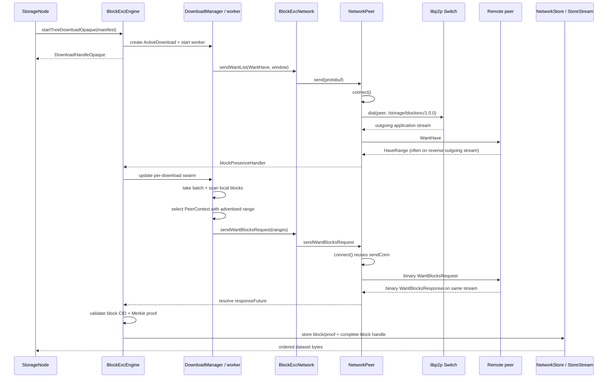

---
tags:
  - logos-storage/download
  - logos-storage/block-exchange
  - logos-storage/libp2p
related:
  - "[[Libp2p connections - connect vs dial]]"
  - "[[Closing libp2p connections and streams]]"
  - "[[Uploading and downloading content in new Logos Storage]]"
  - "[[New Logos Storage Block Exchange Protocol]]"
  - "[[Block Exchange Peer Performance and BDP]]"
  - "[[Libp2p Connection Lifecycle in Logos Storage]]"
  - "[[New Logos Storage Discovery]]"
  - "[[Block Exchange Peer Stores]]"
---

# New Logos Storage Download Flow

> [!info] Source baseline
> This note describes `logos-storage-nim` `master` at commit `81f0d053`
> (2026-07-20), together with its vendored `nim-libp2p`.

This note follows one successful network download in detail, beginning at
`BlockExcEngine.startTreeDownloadOpaque` and ending at the libp2p application
stream on which `WantBlocks` is sent.

The most important point is that starting a download does **not** immediately
call `Switch.dial`. It creates download state and starts an asynchronous worker.
That worker first learns which connected peer has the desired range. Sending
the resulting `WantHave` control message will usually be the operation that
opens the outgoing `/storage/blockexc/1.0.0` stream. The later binary
`WantBlocks` request normally reuses that stream.

The compact call tree is:

```text
StorageNode.streamEntireDataset
  -> BlockExcEngine.startTreeDownloadOpaque
     -> startTreeDownloadGeneric[void]
        -> toDownloadDesc
        -> BlockExcEngine.startDownload
           -> DownloadManager.startDownload
              -> DownloadContext.new
                 -> Scheduler.new + init...
                 -> Swarm.new
              -> ActiveDownload(...)
              -> DownloadManager.downloads[treeCid][downloadId] = download
           -> ensureDownloadWorker
              -> trackedFutures.track(downloadWorker(download))

downloadWorker
  -> broadcastWantHave
     -> BlockExcNetwork.request.sendWantList
        -> BlockExcNetwork.sendWantList
           -> BlockExcNetwork.send
              -> NetworkPeer.send
                 -> NetworkPeer.connect
                    -> getConn
                       -> Switch.dial(peer, "/storage/blockexc/1.0.0")

downloadWorker
  -> selectPeerForBatch
  -> BlockExcEngine.sendWantBlocksRequest
     -> BlockExcEngine.requestWantBlocks
        -> BlockExcNetwork.sendWantBlocksRequest
           -> NetworkPeer.sendWantBlocksRequest
              -> NetworkPeer.connect
                 -> reuse sendConn, or Switch.dial if it is absent
              -> writeWantBlocksRequest
              -> await responseFuture
```

## Two activities begin at the download boundary

The network streaming call constructs both an engine download and a local
store-backed byte stream:

```nim
proc streamEntireDataset(
    self: StorageNodeRef, md: ManifestDescriptor, fetchLocal: bool = false
): Future[?!LPStream] {.async: (raises: [CancelledError]).} =
  let
    treeCid = md.manifest.treeCid
    download = ?self.engine.startTreeDownloadOpaque(md, fetchLocal = fetchLocal)
    stream = LPStream(StoreStream.new(self.networkStore, md.manifest, pad = false))

  var jobs: seq[Future[void]]

  proc fetchTask(): Future[void] {.async: (raises: []).} =
    try:
      if err =? (await download.waitForComplete()).errorOption:
        error "Dataset fetch failed during streaming",
          manifestCid = md.manifestCid, err = err.msg
        await stream.close()
    except CancelledError:
      trace "Dataset fetch cancelled during streaming", manifestCid = md.manifestCid
    finally:
      self.engine.releaseDownload(download)

  jobs.add(fetchTask())
```

This starts two cooperating paths:

1. the `downloadWorker` fetches and validates batches, potentially out of
   order;
2. `StoreStream` asks `NetworkStore` for blocks in file order as the HTTP
   client reads the response.

They meet at `ActiveDownload` block handles. Neither `StoreStream` nor the REST
handler directly sends a block-exchange message.

## Step 1: `startTreeDownloadOpaque` selects the generic void handle

The public function is a thin specialization:

```nim
proc startTreeDownloadOpaque*(
    self: BlockExcEngine,
    md: ManifestDescriptor,
    selectionPolicy: SelectionPolicy = spSequential,
    isBackground: bool = false,
    fetchLocal: bool = false,
): ?!DownloadHandleOpaque =
  startTreeDownloadGeneric[void](
    self,
    md,
    selectionPolicy = selectionPolicy,
    isBackground = isBackground,
    fetchLocal = fetchLocal,
  )
```

`void` means that the caller is interested in completion rather than receiving
each `Block` through the handle's iterator. It does not mean that the engine
does less validation or avoids storing the downloaded blocks.

The generic function turns the manifest into a full-dataset `DownloadDesc`,
starts the engine download, and returns a handle referring to its completion
future:

```nim
let
  desc = toDownloadDesc(
    md,
    selectionPolicy = selectionPolicy,
    isBackground = isBackground,
    fetchLocal = fetchLocal,
  )
  activeDownload = self.startDownload(desc)
  treeCid = md.manifest.treeCid
  totalBlocks = md.manifest.blocksCount.uint64

success DownloadHandleGeneric[T](
  treeCid: treeCid,
  downloadId: activeDownload.id,
  iter: SafeAsyncIter[T].new(genNext, isFinished),
  completionFuture: activeDownload.completionFuture,
)
```

For a streaming download, `fetchTask` awaits `completionFuture`; it does not
drive the opaque iterator. Ordered demand instead comes from
`StoreStream -> NetworkStore`, described below.

## Step 2: the manifest becomes a `DownloadDesc`

`toDownloadDesc` covers every data-block index in the manifest:

```nim
proc toDownloadDesc*(
    md: ManifestDescriptor,
    selectionPolicy: SelectionPolicy = spSequential,
    isBackground: bool = false,
    fetchLocal: bool = false,
): DownloadDesc =
  DownloadDesc(
    md: md,
    startIndex: 0,
    count: md.manifest.blocksCount.uint64,
    selectionPolicy: selectionPolicy,
    isBackground: isBackground,
    fetchLocal: fetchLocal,
  )
```

The manifest has already been fetched by this point. Discovery and block
exchange use its two identities differently:

- `manifestCid` is the provider-discovery key;
- `manifest.treeCid` plus block indices address the actual data and proofs.

## Step 3: `DownloadManager` creates the long-lived download state

The private engine wrapper first delegates state creation to
`DownloadManager`, then ensures exactly one worker is running for this
download ID:

```nim
proc startDownload(
    self: BlockExcEngine, desc: DownloadDesc
): ActiveDownload {.gcsafe, raises: [].} =
  result = self.downloadManager.startDownload(desc)
  self.ensureDownloadWorker(result)
```

`DownloadManager.startDownload` creates a `DownloadContext` and an
`ActiveDownload`, assigns a unique ID, and stores it by tree CID and download
ID:

```nim
proc startDownload*(
    self: DownloadManager, desc: DownloadDesc, missingBlocks: seq[uint64] = @[]
): ActiveDownload =
  let
    ctx = DownloadContext.new(desc, missingBlocks)
    downloadId = self.nextDownloadId

  self.nextDownloadId += 1

  let download = ActiveDownload(
    id: downloadId,
    ctx: ctx,
    blocks: initTable[BlockAddress, BlockReq](),
    pendingBatches: initTable[uint64, PendingBatch](),
    exhaustedBlocks: initHashSet[BlockAddress](),
    maxBlockRetries: self.maxBlockRetries,
    retryInterval: self.retryInterval,
    isBackground: desc.isBackground,
    fetchLocal: desc.fetchLocal,
    completionFuture:
      Future[?!void].Raising([CancelledError]).init("ActiveDownload.completion"),
  )

  self.downloads.mgetOrPut(
    desc.md.manifest.treeCid, initTable[uint64, ActiveDownload]()
  )[downloadId] = download

  return download
```

The two peer collections inside this process have different roles:

- `BlockExcEngine.peers` is node-wide and contains connected `PeerContext`s;
- `download.ctx.swarm` is private to this download and records which of those
  peers claim availability for which ranges.

See [[Block Exchange Peer Stores]] for their complete lifecycles.

## Step 4: `DownloadContext` initializes scheduling and availability

The manifest block size determines the approximately 1 MiB batch size and the
number of blocks represented by the 1 GiB presence window:

```nim
let
  totalBlocks = desc.startIndex + desc.count
  batchSize = computeBatchSize(blockSize)
  windowSize = computeWindowSize(blockSize)

result = DownloadContext(
  md: desc.md,
  totalBlocks: totalBlocks,
  scheduler: Scheduler.new(),
  swarm: Swarm.new(),
)
```

An ordinary stream uses the sequential scheduler:

```nim
if desc.startIndex == 0:
  result.scheduler.init(
    desc.count, batchSize.uint64, windowSize, PresenceWindowThreshold
  )
```

The scheduler tracks pending, requeued, in-flight, and completed batches. Its
`take` method marks work in flight before giving it to the worker:

```nim
proc take*(self: Scheduler): Option[BlockBatch] =
  while self.requeued.len > 0:
    let batch = self.requeued.popFirst()
    if batch.start < self.completedWatermark:
      continue
    if batch.start in self.completedOutOfOrder:
      continue
    self.inFlight[batch.start] = batch.count
    return some(batch)

  let batchOpt = self.generateNextBatchInternal()
  if batchOpt.isSome:
    let batch = batchOpt.get()
    self.inFlight[batch.start] = batch.count
  return batchOpt
```

Taking a batch is therefore a state transition, not merely a read. Every path
that cannot finish it must either requeue it, partially complete it, or mark it
complete.

## Step 5: the asynchronous worker is started

`ensureDownloadWorker` does not await the worker. It registers a tracked task
and returns, allowing `startTreeDownloadOpaque` to return its handle while
network work proceeds concurrently:

```nim
proc ensureDownloadWorker(
    self: BlockExcEngine, download: ActiveDownload
) {.gcsafe, raises: [].} =
  let id = download.id
  if id in self.activeDownloads:
    return

  self.activeDownloads.incl(id)

  proc wrappedDownloadWorker() {.async: (raises: []).} =
    try:
      await self.downloadWorker(download)
    finally:
      self.activeDownloads.excl(id)

  self.trackedFutures.track(wrappedDownloadWorker())
```

At this point:

- no batch request has necessarily been sent;
- no block-exchange application stream has necessarily been opened;
- the caller already has a `DownloadHandleOpaque`;
- the worker is now responsible for making progress.

## Step 6: the worker asks connected peers what they have

At startup, the worker reads the first presence window and samples up to
`deltaMax` node-wide connected peers:

```nim
let
  (windowStart, windowCount) = download.ctx.currentPresenceWindow()
  maxSwarmPeers = download.ctx.swarm.config.deltaMax

var connectedPeers = self.peers.toSeq()
if connectedPeers.len > maxSwarmPeers:
  shuffle(connectedPeers)
  connectedPeers.setLen(maxSwarmPeers)

if connectedPeers.len > 0:
  await self.broadcastWantHave(download, windowStart, windowCount, connectedPeers)
else:
  self.searchForNewPeers(download.manifestCid)
```

`self.peers` here is `BlockExcEngine.peers`, not the per-download swarm. A
connected peer is first added to the swarm with `Unknown` availability and is
then asked about the window:

```nim
proc broadcastWantHave(
    self: BlockExcEngine,
    download: ActiveDownload,
    start: uint64,
    count: uint64,
    peers: seq[PeerContext],
) {.async: (raises: [CancelledError]).} =
  let rangeAddress = BlockAddress.init(download.treeCid, start)
  for peerCtx in peers:
    if not download.addPeerIfAbsent(peerCtx.id, BlockAvailability.unknown()):
      continue

    await self.network.request
      .sendWantList(
        peerCtx.id,
        @[rangeAddress],
        wantType = WantType.WantHave,
        rangeCount = count,
        downloadId = download.id,
      )
      .wait(DefaultWantHaveSendTimeout)
```

This is the first important descent from the engine into
`BlockExcNetwork`.

## Step 7: `WantHave` usually opens the outgoing application stream

`network.request.sendWantList` is a function field initialized as a wrapper
around `BlockExcNetwork.sendWantList`. That function builds the protobuf
message and delegates to `BlockExcNetwork.send`:

```nim
proc sendWantList*(
    b: BlockExcNetwork,
    id: PeerId,
    addresses: seq[BlockAddress],
    priority: int32 = 0,
    cancel: bool = false,
    wantType: WantType = WantType.WantHave,
    full: bool = false,
    sendDontHave: bool = false,
    rangeCount: uint64 = 0,
    downloadId: uint64 = 0,
) {.async: (raw: true, raises: [CancelledError]).} =
  let msg = WantList(
    entries: addresses.mapIt(
      WantListEntry(
        address: it,
        wantType: wantType,
        rangeCount: rangeCount,
        downloadId: downloadId,
      )
    ),
    full: full,
  )

  b.send(id, Message(wantlist: msg))
```

`BlockExcNetwork.send` looks up the already-created `NetworkPeer` and calls its
generic protobuf sender:

```nim
proc send*(
    b: BlockExcNetwork, id: PeerId, msg: Message
) {.async: (raises: [CancelledError]).} =
  if not (id in b.peers):
    return

  let peer = b.peers[id]
  await b.inflightSema.acquire()
  try:
    await peer.send(msg)
  finally:
    b.inflightSema.release()
```

`NetworkPeer.send` calls `NetworkPeer.connect` before encoding and writing:

```nim
proc send*(
    self: NetworkPeer, msg: Message
) {.async: (raises: [CancelledError, LPStreamError]).} =
  let conn = await self.connect()
  if isNil(conn):
    return

  let msgData = msg.encode()
  # four-byte frame length, one-byte mtProtobuf discriminator, then protobuf
  await conn.write(buf)
```

The name `NetworkPeer.connect` is easy to confuse with `Switch.connect`.
They are not the same operation:

```nim
proc connect*(
    self: NetworkPeer
): Future[Connection] {.async: (raises: [CancelledError]).} =
  if self.connected:
    return self.sendConn

  self.sendConn = await self.getConn()
  self.trackedFutures.track(self.readLoop(self.sendConn))
  return self.sendConn
```

This `connect` ensures that the `NetworkPeer` has its retained outgoing
**application stream**. `getConn` was captured when `BlockExcNetwork` created
the peer:

```nim
var getConn: ConnProvider = proc(): Future[Connection] {.
    async: (raises: [CancelledError])
.} =
  try:
    return await self.switch.dial(peer, Codec)
  except CancelledError as error:
    raise error
  except CatchableError as exc:
    trace "Unable to connect to blockexc peer", exc = exc.msg
```

Here `Codec` is:

```nim
const Codec* = "/storage/blockexc/1.0.0"
```

Finally, `Switch.dial(peer, Codec)` asks the connection manager for a new muxed
stream on an existing peer connection and negotiates the codec:

```nim
method dial*(
    self: Dialer, peerId: PeerId, protos: seq[string]
): Future[Stream] {.async: (raises: [DialFailedError, CancelledError]).} =
  let stream = await self.connManager.getStream(peerId)
  if stream.isNil:
    raise newException(DialFailedError, "Couldn't get muxed stream")
  return await self.negotiateStream(stream, protos)
```

This is the precise point where the outgoing block-exchange application stream
is created. The existing TCP/Noise/Yamux connection is reused.

## What if there was no connected peer?

The worker queues provider discovery using the manifest CID:

```nim
proc searchForNewPeers(self: BlockExcEngine, cid: Cid) =
  if self.lastDiscRequest + DiscoveryRateLimit < Moment.now():
    self.lastDiscRequest = Moment.now()
    self.discovery.queueFindBlocksReq(@[cid])
```

The discovery task resolves provider records and asks `BlockExcNetwork` to
dial each provider:

```nim
let request = b.discovery.find(cid)
if (await request.withTimeout(DefaultDiscoveryTimeout)) and
    peers =? (await request).catch:
  let dialed = await allFinished(peers.mapIt(b.network.dialPeer(it.data)))
```

`dialPeer` deliberately uses `Switch.connect`, not `Switch.dial`:

```nim
proc dialPeer*(self: BlockExcNetwork, peer: PeerRecord) {.async.} =
  if self.isSelf(peer.peerId):
    return
  if peer.peerId in self.peers:
    return

  await self.switch.connect(peer.peerId, peer.addresses.mapIt(it.address))
```

`Switch.connect` establishes or reuses the transport, security, and muxer
layers without opening a protocol stream. The resulting `PeerEvent.Joined`
creates the node-wide `NetworkPeer` and `PeerContext`.

The download worker is not directly resumed by a special “provider found”
callback. It continues its retry loop. On a later iteration it sees the new
connected peer, sends `WantHave`, and that message descends through
`NetworkPeer.connect -> Switch.dial` as shown above.

Thus the no-peer path is:

```text
downloadWorker
  -> searchForNewPeers(manifestCid)
  -> DiscoveryEngine.queueFindBlocksReq
  -> discovery.find(manifestCid)
  -> BlockExcNetwork.dialPeer
  -> Switch.connect
     [physical secured muxed connection; PeerEvent.Joined]
  -> worker retry / WantHave broadcast
  -> NetworkPeer.connect
  -> Switch.dial("/storage/blockexc/1.0.0")
     [application stream]
```

See [[New Logos Storage Discovery]] for the Discv5 and MIX-assisted variants.

## Step 8: presence returns and populates the per-download swarm

On the provider, the mounted protocol handler attaches `readLoop` to an
incoming block-exchange stream:

```nim
proc handler(
    conn: Connection, proto: string
): Future[void] {.async: (raises: [CancelledError]).} =
  let peerId = conn.peerId
  let blockexcPeer = self.getOrCreatePeer(peerId)
  await blockexcPeer.readLoop(conn)
```

`readLoop` recognizes the protobuf discriminator and dispatches the message:

```nim
case msgType
of mtProtobuf:
  var data = newSeq[byte](dataLen)
  await conn.readExactly(addr data[0], dataLen)
  let msg = Message.decode(data).mapFailure().tryGet()
  await self.handler(self, msg)
```

The provider's `wantListHandler` scans local `(treeCid, index)` entries and
constructs contiguous `HaveRange` responses. It then calls:

```nim
await self.network.request.sendPresence(peer, presence).wait(
  DefaultWantHaveSendTimeout
)
```

There is an important stream-direction detail here. An incoming stream is
attached to `readLoop`, but it is not assigned to that node's `sendConn`.
Therefore `sendPresence` goes through the provider's own
`NetworkPeer.send -> NetworkPeer.connect`. If it has no retained outgoing
stream yet, the provider opens a block-exchange stream in the reverse
direction. Control messages are not necessarily answered on the stream on
which they arrived.

Back on the downloader, the presence message reaches:

```text
NetworkPeer.readLoop
  -> BlockExcNetwork.rpcHandler
  -> BlockExcNetwork.handleBlockPresence
  -> BlockExcEngine.blockPresenceHandler
  -> ActiveDownload.updatePeerAvailability
  -> Swarm.addPeer/updatePeerAvailability
```

The engine correlates presence with the download using `downloadId` and the
tree CID:

```nim
let
  treeCid = presence.address.treeCid
  downloadOpt = self.downloadManager.getDownload(blk.downloadId, treeCid)

if downloadOpt.isSome:
  let availability =
    case presence.presenceType
    of BlockPresenceType.Complete:
      BlockAvailability.complete()
    of BlockPresenceType.HaveRange:
      BlockAvailability.fromRanges(presence.ranges)
    of BlockPresenceType.DontHave:
      BlockAvailability.unknown()

  downloadOpt.get().updatePeerAvailability(peer, availability)
```

Only now does the per-download swarm know that the peer is a candidate for a
specific batch.

## Step 9: the worker takes a batch and scans local storage

The main loop obtains work from the scheduler:

```nim
let batchOpt = self.downloadManager.getNextBatch(download)
if batchOpt.isNone:
  await sleepAsync(100.milliseconds)
  continue

let (start, count) = batchOpt.get()
```

It then checks every address in that batch:

```nim
for i in start ..< start + count:
  let address = download.makeBlockAddress(i)
  let exists = await address in self.localStore

  var missing = not exists
  if exists:
    let blkResult = await self.localStore.getBlock(address)
    if blkResult.isOk:
      localBlockCount += 1
      if address in download.blocks:
        discard download.completeWantHandle(address, some(blkResult.get))
    else:
      missing = true

  if missing:
    missingIndices.add(i)
```

If the whole batch is local, the scheduler marks it complete without a network
request. Otherwise, only missing indices are requested; contiguous missing
indices are later coalesced into ranges.

## Step 10: the swarm selects a connected peer with capacity

The worker asks the per-download swarm for a peer that advertised the range:

For the complete derivation of adaptive pipeline depth, rolling throughput,
request-latency samples, exploration, and the weighted peer score, see
[[Block Exchange Peer Performance and BDP]].

```nim
let
  batchBytes = download.ctx.batchBytes
  selection = swarm.selectPeerForBatch(
    self.peers, start, count, batchBytes, self.downloadManager.peerTracker
  )
```

`selectPeerForBatch` first considers peers with the complete range, then peers
with any overlapping range. For each candidate it requires:

1. a live node-wide `PeerContext` in `BlockExcEngine.peers`;
2. available BDP-derived pipeline capacity.

```nim
for peerId in candidates:
  let peer = peers.get(peerId)
  if peer.isNil:
    discard swarm.removePeer(peerId)
    continue
  if tracker.count(peerId) < peer.optimalPipelineDepth(batchBytes):
    peerCtxs.add(peer)
```

No suitable peer causes the batch to be requeued. A peer at capacity also
causes requeueing, but only briefly; it is not treated as failure.

## Step 11: the batch is marked in flight before the request starts

Once a peer is selected:

```nim
let peer = selection.peer

download.markBatchInFlight(start, count, localBlockCount, peer.id)

let batchFuture =
  self.sendWantBlocksRequest(download, start, count, missingIndices, peer)

self.downloadManager.peerTracker.track(peer.id, batchFuture)
download.setBatchRequestFuture(start, batchFuture)
```

`PendingBatch` records the selected peer, local block count, send time,
request future, and timeout future. This lets timeout, disconnect, and response
paths determine whether the batch still belongs to the same attempt.

## Step 12: the engine constructs the binary range request

The private engine method coalesces sorted missing indices:

```nim
var ranges: seq[IndexRange] = @[]
if missingIndices.len > 0:
  var
    rangeStart = missingIndices[0]
    rangeCount: uint64 = 1

  for i in 1 ..< missingIndices.len:
    if missingIndices[i] == rangeStart + rangeCount:
      rangeCount += 1
    else:
      ranges.add(IndexRange(start: rangeStart, count: rangeCount))
      rangeStart = missingIndices[i]
      rangeCount = 1

  ranges.add(IndexRange(start: rangeStart, count: rangeCount))

let requestResult = await self.requestWantBlocks(
  peer.id, BlockRange(treeCid: treeCid, ranges: ranges)
)
```

The public engine method translates the wire response into zero-copy
`BlockDeliveryView`s:

```nim
proc requestWantBlocks*(
    self: BlockExcEngine, peer: PeerId, blockRange: BlockRange
): Future[WantBlocksResult[seq[BlockDeliveryView]]] {.
    async: (raises: [CancelledError])
.} =
  let response = ?await self.network.sendWantBlocksRequest(peer, blockRange)
  var blockViews: seq[BlockDeliveryView]

  for btBlock in response.blocks:
    let viewResult =
      toBlockDeliveryView(btBlock, response.treeCid, response.sharedBuffer)
    if viewResult.isOk:
      blockViews.add(viewResult.get)

  return ok(blockViews)
```

## Step 13: `WantBlocks` reaches `NetworkPeer.connect`

`BlockExcNetwork` ensures a `NetworkPeer` exists and delegates:

```nim
proc sendWantBlocksRequest*(
    self: BlockExcNetwork, peer: PeerId, blockRange: BlockRange
): Future[WantBlocksResult[WantBlocksResponse]] {.async: (raises: [CancelledError]).} =
  let networkPeer = self.getOrCreatePeer(peer)
  return await networkPeer.sendWantBlocksRequest(blockRange)
```

The peer allocates a request ID and a future before ensuring the stream:

```nim
proc sendWantBlocksRequest*(
    self: NetworkPeer, blockRange: BlockRange
): Future[WantBlocksResult[WantBlocksResponse]] {.async: (raises: [CancelledError]).} =
  let requestId = self.nextRequestId
  self.nextRequestId += 1

  let responseFuture = WantBlocksResponseFuture.init("wantBlocksRequest")
  self.pendingWantBlocksRequests[requestId] = responseFuture

  try:
    let conn = await self.connect()
    if isNil(conn):
      self.pendingWantBlocksRequests.del(requestId)
      return err(wantBlocksError(NoConnection, "No connection available"))

    let req = WantBlocksRequest(
      requestId: requestId,
      treeCid: blockRange.treeCid,
      ranges: blockRange.ranges,
    )
    await writeWantBlocksRequest(conn, req)
    return await responseFuture
```

This is the second route to `NetworkPeer.connect`.

- Normally the earlier `WantHave` already initialized `sendConn`, so
  `connect` returns it immediately.
- If no earlier control message opened a stream, this call invokes
  `getConn -> Switch.dial` and creates the outgoing block-exchange stream now.
- If an old application stream closed, `sendConn` was cleared and this call
  opens a replacement stream over the still-connected peer muxer.

The binary request and response use the same application stream. This differs
from protobuf presence responses: `readLoop` handles
`mtWantBlocksRequest` and writes the answer directly to its `conn`:

```nim
of mtWantBlocksRequest:
  let reqResult = await readWantBlocksRequest(conn, dataLen)
  let
    req = reqResult.get
    blocks = await self.wantBlocksHandler(self.id, req)
  await writeWantBlocksResponse(conn, req.requestId, req.treeCid, blocks)
```

## Step 14: the response future reconnects the read loop to the engine

On the requester, the read loop decodes the response and resolves the future
stored under its request ID:

```nim
of mtWantBlocksResponse:
  let respResult = await readWantBlocksResponse(conn, dataLen)
  let response = respResult.get
  self.pendingWantBlocksRequests.withValue(response.requestId, fut):
    if not fut[].finished:
      fut[].complete(WantBlocksResult[WantBlocksResponse].ok(response))
    self.pendingWantBlocksRequests.del(response.requestId)
```

Resolving that future resumes:

```text
NetworkPeer.sendWantBlocksRequest
  -> BlockExcNetwork.sendWantBlocksRequest
  -> BlockExcEngine.requestWantBlocks
  -> BlockExcEngine.sendWantBlocksRequest
```

The request ID correlates concurrent wire requests on one stream. The
download ID is used by protobuf presence discovery, but is not part of the
binary `WantBlocksRequest`.

## Step 15: validate, store, and complete waiting readers

For every returned view the engine verifies:

- the index was requested;
- the index is within manifest bounds;
- the data hashes to the claimed block CID;
- the Merkle proof index matches the block index;
- the proof connects the block hash to the requested tree CID.

Only then does it store the block and proof:

```nim
let
  bd = view.toBlockDelivery()
  putResult = await self.localStore.putBlock(bd.blk)

let proofResult = await self.localStore.putCidAndProof(
  bd.address.treeCid, bd.address.index, bd.blk.cid, bd.proof.get
)

if bd.address in download.blocks:
  discard download.completeWantHandle(bd.address, some(bd.blk))
```

The last line wakes any `NetworkStore.getBlock(address)` currently waiting for
that block.

After all valid entries are processed, a complete batch advances the scheduler
and the download counters:

```nim
proc completeBatch*(
    download: ActiveDownload,
    start: uint64,
    blocksDeliveryCount: uint64,
    totalBytes: uint64,
) =
  download.pendingBatches.del(start)
  download.ctx.scheduler.markComplete(start)
  download.ctx.markBatchReceived(
    start, localCount + blocksDeliveryCount, totalBytes
  )
  download.signalCompletionIfDone()
```

A partial response preserves valid blocks and requeues only the missing
ranges.

## Step 16: `StoreStream` observes the stored result in file order

As the HTTP server reads the response stream, `StoreStream` maps its byte
offset to a block address:

```nim
let
  blockNum = self.offset div self.manifest.blockSize.int
  blockOffset = self.offset mod self.manifest.blockSize.int
  address = BlockAddress(
    treeCid: self.manifest.treeCid, index: blockNum.uint64
  )

without blk =? (await self.store.getBlock(address)).tryGet.catch, error:
  raise newLPStreamReadError(error)
```

The store is `NetworkStore`. It creates or retrieves a per-address future,
checks local storage once, and otherwise waits:

```nim
method getBlock*(
    self: NetworkStore, address: BlockAddress
): Future[?!Block] {.async: (raises: [CancelledError]).} =
  let downloadOpt = self.engine.downloadManager.getDownload(address.treeCid)
  if downloadOpt.isSome:
    let handle = downloadOpt.get().getWantHandle(address)
    without blk =? (await self.localStore.getBlock(address)), err:
      if not (err of BlockNotFoundError):
        handle.cancelSoon()
        return failure err
      return await handle
    discard downloadOpt.get().completeWantHandle(address, some(blk))
    return success blk

  return await self.localStore.getBlock(address)
```

This is why the worker may fetch out of order while the HTTP response remains
ordered. A requested block either already exists locally or its handle is
completed after the validated network response is stored.

## Step 17: completion and release

The opaque handle completes when the download context reports all blocks
received:

```nim
proc signalCompletionIfDone(download: ActiveDownload, error: ref StorageError = nil) =
  if download.completionFuture.finished:
    return
  if error != nil:
    download.completionFuture.complete(void.failure(error))
  elif download.ctx.isComplete:
    download.completionFuture.complete(success())
```

`streamEntireDataset.fetchTask` then calls:

```nim
self.engine.releaseDownload(download)
```

Release delegates to `DownloadManager.cancelDownload`, which removes this
`ActiveDownload` from `downloads`, cancels any remaining request/timeout
futures, and finishes outstanding block handles. It does **not** disconnect
the peer, remove its `NetworkPeer`, remove its `PeerContext`, or close a healthy
retained block-exchange `sendConn`.

## Successful-path sequence



## Where “connection” is created in this flow

The word is overloaded, so the final answer depends on which layer is meant:

| Moment | Operation | What is created |
|---|---|---|
| provider discovery result | `BlockExcNetwork.dialPeer -> Switch.connect` | TCP/Noise/Yamux peer connectivity, unless already present |
| first `WantHave` send | `NetworkPeer.connect -> Switch.dial(Codec)` | normally the first outgoing block-exchange application stream |
| first `WantBlocks` send | `NetworkPeer.connect` | reuses `sendConn`, or opens the application stream if still absent |
| application stream failed | later `NetworkPeer.connect` | a replacement application stream over surviving peer connectivity |

The `Connection` visible to the Logos Storage block-exchange code is the muxed
application stream returned by `Switch.dial`, not the underlying transport
connection. This distinction is central to the planned transport-like
abstraction over MIX.

## Source map

- `storage/node.nim`
  - `streamEntireDataset`
- `storage/blockexchange/engine/engine.nim`
  - `startTreeDownloadGeneric`
  - `ensureDownloadWorker`
  - `downloadWorker`
  - `broadcastWantHave`
  - both `sendWantBlocksRequest` layers
- `storage/blockexchange/engine/downloadmanager.nim`
  - `startDownload`
  - `getNextBatch`
- `storage/blockexchange/engine/downloadcontext.nim`
  - `DownloadContext.new`
- `storage/blockexchange/engine/scheduler.nim`
  - `take`, requeue, completion, and presence-window state
- `storage/blockexchange/engine/swarm.nim`
  - `selectPeerForBatch`
- `storage/blockexchange/network/network.nim`
  - `sendWantList`, `send`, `sendWantBlocksRequest`, `getOrCreatePeer`
- `storage/blockexchange/network/networkpeer.nim`
  - `connect`, `send`, `sendWantBlocksRequest`, `readLoop`
- `storage/stores/networkstore.nim`
  - address-based `getBlock`
- `storage/streams/storestream.nim`
  - `readOnce`
- `vendor/nim-libp2p/libp2p/switch.nim`
  - `connect` and `dial`
- `vendor/nim-libp2p/libp2p/dialer.nim`
  - existing-connection `dial`
