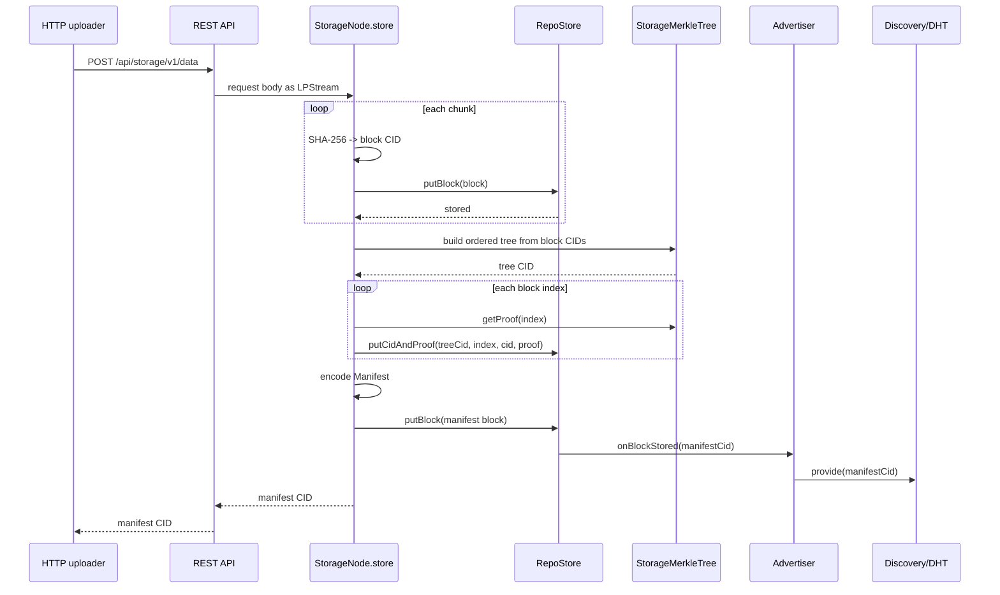
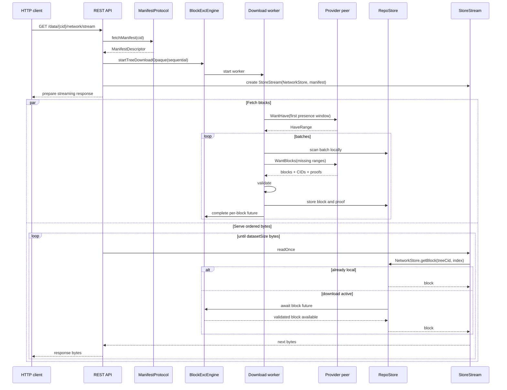

---
tags:
  - logos-storage/upload
  - logos-storage/download
  - logos-storage/block-exchange
related:
  - "[[Libp2p connections - connect vs dial]]"
  - "[[Closing libp2p connections and streams]]"
  - "[[New Logos Storage Block Exchange Protocol]]"
  - "[[New Logos Storage Download Flow]]"
  - "[[Libp2p Connection Lifecycle in Logos Storage]]"
---

# Uploading and downloading content in new Logos Storage

> [!info] Source baseline
> This note describes `logos-storage-nim` `master` at commit `81f0d053` (2026-07-20).

This note follows content from the REST API into local storage and then back out through either local or network retrieval. For the wire protocol, scheduling, peer selection, and failure behavior, see [[New Logos Storage Block Exchange Protocol]].

The tutorial follows concrete call chains:

```text
HTTP request body
  -> LPStream
  -> StorageNode.store
  -> content blocks + Merkle proofs + manifest
  -> RepoStore
  -> manifest advertisement

HTTP download request
  -> ManifestProtocol.fetchManifest
  -> BlockExcEngine.startTreeDownloadOpaque
  -> NetworkStore.getBlock(BlockAddress)
  -> StoreStream.readOnce
  -> HTTP response body
```

The important architectural trick is that network retrieval is made to look
like reading from a block store. The block-exchange engine runs concurrently
and resolves the address futures on which `NetworkStore` and `StoreStream`
wait.

## Architecture diagram

> This diagram is an Obsidian Excalidraw drawing. To edit it, open this vault in Obsidian with the Excalidraw plugin installed and enabled.

![[Uploading and downloading content in new Logos Storage 2026-07-23.excalidraw.svg]]
%%[[Uploading and downloading content in new Logos Storage 2026-07-23.excalidraw.md|🖋 Edit in Excalidraw]]%%

> This code-flow view is an Obsidian Excalidraw drawing. To edit it, open this vault in Obsidian with the Excalidraw plugin installed and enabled.

![[Uploading and downloading content in new Logos Storage - code flow 2026-07-23.excalidraw.svg]]
%%[[Uploading and downloading content in new Logos Storage - code flow 2026-07-23.excalidraw.md|🖋 Edit code-flow view in Excalidraw]]%%

## The content model

An uploaded file is represented as:

```text
manifest CID
  └── Manifest
        ├── tree CID
        ├── block size
        ├── dataset size
        ├── CID/hash codecs
        ├── optional filename
        └── optional MIME type

tree CID
  ├── index 0 -> block CID + Merkle proof
  ├── index 1 -> block CID + Merkle proof
  ├── ...
  └── index N -> block CID + Merkle proof

block CID -> block bytes
```

There are two different kinds of content-addressed objects:

- the **manifest block**, whose CID uses the `storage-manifest` codec;
- **data blocks**, whose CIDs use the `storage-block` codec.

The tree CID is the Merkle root of the ordered data-block hashes. It is an identity and verification root, not a separately downloaded list of blocks.

The local `RepoStore` maintains both:

- block CID → bytes; and
- `(treeCid, index)` → `(blockCid, Merkle proof)`.

The second mapping is what lets a node serve and validate a dataset leaf by position.

## Uploading content

The REST entry point is:

```http
POST /api/storage/v1/data
```

Optional inputs include:

- `Content-Disposition` filename;
- `Content-Type`;
- `blockSize` query parameter.

`blockSize` defaults to 64 KiB and must be a power of two between 4 KiB and 512 KiB.

### 1. REST body becomes an `LPStream`

`storage/rest/api.nim` obtains the streaming request-body reader and wraps it in `AsyncStreamWrapper`. It then calls:

```nim
node.store(stream, filename, mimetype, blockSize)
```

The whole upload does not need to be loaded into memory.

The endpoint passes the request-body reader to the node as an `LPStream`:

```nim
var bodyReader = request.getBodyReader()
if bodyReader.isErr():
  return RestApiResponse.error(Http500, msg = bodyReader.error())

let reader = bodyReader.get()

try:
  without cid =? (
    await node.store(
      AsyncStreamWrapper.new(reader = AsyncStreamReader(reader)),
      filename = filename,
      mimetype = mimetype,
      blockSize = blockSize,
    )
  ), error:
    error "Error uploading file", exc = error.msg
    return RestApiResponse.error(Http500, error.msg)
```

### 2. The stream is chunked

`StorageNodeRef.store` creates an `LPStreamChunker` with the selected block size and repeatedly reads chunks.

For each chunk:

1. hash bytes with SHA-256;
2. construct a CIDv1 `storage-block` CID;
3. construct a `Block` without re-hashing it again;
4. append its CID to the ordered `cids` list;
5. call `NetworkStore.putBlock`.

`NetworkStore.putBlock` now only writes through to the local store. It does **not** call the old `engine.resolveBlocks` path.

The implementation keeps only the ordered CID list needed to build the tree:

```nim
let
  hcodec = Sha256HashCodec
  dataCodec = BlockCodec
  chunker = LPStreamChunker.new(stream, chunkSize = blockSize)

var cids: seq[Cid]

try:
  while (let chunk = await chunker.getBytes(); chunk.len > 0):
    without mhash =? MultiHash.digest($hcodec, chunk).mapFailure, err:
      return failure(err)

    without cid =? Cid.init(CIDv1, dataCodec, mhash).mapFailure, err:
      return failure(err)

    without blk =? bt.Block.new(cid, chunk, verify = false):
      return failure("Unable to init block from chunk!")

    cids.add(cid)

    if err =? (await self.networkStore.putBlock(blk)).errorOption:
      return failure(&"Unable to store block {blk.cid}")
except CancelledError as exc:
  raise exc
except CatchableError as exc:
  return failure(exc.msg)
finally:
  await stream.close()
```

### 3. Each block is stored locally

`RepoStore.putBlock` stores the bytes and metadata, updates quota/accounting, and invokes `onBlockStored` for a newly stored block.

The block-exchange `Advertiser` receives this callback, but filters it:

- ordinary data-block CIDs are not advertised;
- only manifest CIDs are queued for provider advertisement.

This avoids publishing one DHT provider record per data block.

### 4. Build the Merkle tree

After the input stream ends, the node builds `StorageMerkleTree` from the ordered list of block CIDs and computes its tree CID.

For every index it obtains an inclusion proof and stores:

```text
(treeCid, index) -> (blockCid, proof)
```

At this point, the data blocks can be served through a `WantBlocks` request using the tree CID and ranges of indices.

```nim
without tree =? (await StorageMerkleTree.init(self.taskPool, cids)), err:
  return failure(err)

without treeCid =? tree.rootCid(CIDv1, dataCodec), err:
  return failure(err)

for index, cid in cids:
  without proof =? tree.getProof(index), err:
    return failure(err)
  if err =?
      (await self.networkStore.putCidAndProof(treeCid, index, cid, proof)).errorOption:
    return failure(err)
```

### 5. Build and store the manifest

The node creates a `Manifest` containing:

```text
treeCid
blockSize
datasetSize
CID version
hash codec
data codec
filename?
mimetype?
```

The encoded manifest becomes one content-addressed `storage-manifest` block. Its CID is returned to the uploader.

```nim
let manifest = Manifest.new(
  treeCid = treeCid,
  blockSize = blockSize,
  datasetSize = NBytes(chunker.offset),
  version = CIDv1,
  hcodec = hcodec,
  codec = dataCodec,
  filename = filename,
  mimetype = mimetype,
)

without manifestBlk =? await self.storeManifest(manifest), err:
  error "Unable to store manifest"
  return failure(err)

return manifestBlk.cid.success
```

### 6. Advertise the manifest CID

When the manifest block is stored:

1. `RepoStore.onBlockStored` calls `Advertiser`;
2. `Advertiser` recognizes the manifest codec;
3. it queues the manifest CID;
4. worker tasks call `Discovery.provide(manifestCid)`;
5. the node's signed peer record becomes discoverable as a provider.

The advertiser also scans and re-advertises all local manifests every 30 minutes by default.

```nim
proc advertiseBlock(b: Advertiser, cid: Cid) {.async: (raises: [CancelledError]).} =
  without isM =? cid.isManifest, err:
    warn "Unable to determine if cid is manifest"
    return

  try:
    if isM:
      # announce manifest cid
      await b.addCidToQueue(cid)
  except CancelledError as exc:
    trace "Cancelled advertise block", cid
    raise exc
  except CatchableError as e:
    error "failed to advertise block", cid, error = e.msgDetail
```

### Upload sequence



## Download API variants

The current REST API exposes several distinct operations:

| Endpoint | Behavior |
| --- | --- |
| `GET /api/storage/v1/data/{cid}` | Require the manifest CID locally, then stream the dataset. See the implementation nuance below. |
| `GET /api/storage/v1/data/{cid}/network/stream` | Fetch missing data from the network while streaming it to the caller. |
| `POST /api/storage/v1/data/{cid}/network` | Start a background network download and return a `downloadId`. |
| `GET /api/storage/v1/data/{cid}/network/progress/{downloadId}` | Report active download blocks/bytes. |
| `DELETE /api/storage/v1/data/{cid}/network/{downloadId}` | Cancel one background download. |
| `GET /api/storage/v1/data/{cid}/network/manifest` | Fetch and return only the decoded manifest. |
| `GET /api/storage/v1/data/{cid}/exists` | Check whether the given CID itself exists locally. |

The important distinction is between:

- **streaming download** — consumers read in dataset order while fetching runs concurrently;
- **background download** — the engine fills the local store without returning block bytes to this caller.

## Step zero: fetch the manifest

Every dataset download needs the manifest before block exchange can be scheduled.

`StorageNode.fetchManifest` delegates to `ManifestProtocol.fetchManifest`:

```text
/storage/manifest/1.0.0
```

### Local fast path

The node first checks `RepoStore` by manifest CID. If present, it decodes and returns the manifest.

### Network path

If the manifest is absent:

1. call `Discovery.find(manifestCid)`;
2. obtain signed provider records;
3. dial each candidate on `/storage/manifest/1.0.0`;
4. send the length-prefixed manifest CID;
5. receive `Found + bytes` or `NotFound`;
6. verify that the bytes hash to the requested manifest CID;
7. store the manifest block locally;
8. decode it.

The fetch loop defaults to 10 attempts, 3 seconds between attempts, and a 30-second timeout per peer fetch.

Provider lookup may be direct DHT or, when private queries are enabled, a DHT lookup through a configured proxy over MIX. Manifest bytes and dataset blocks are still fetched over their respective direct libp2p application protocols.

The per-provider attempt demonstrates the separation from block exchange. It
opens its own protocol stream, performs one verified exchange, and closes the
stream:

```nim
proc fetchManifestFromPeer(
    self: ManifestProtocol, peer: PeerRecord, cid: Cid
): Future[?!bt.Block] {.async: (raises: [CancelledError]).} =
  var conn: Connection
  try:
    conn = await self.switch.dial(
      peer.peerId, peer.addresses.mapIt(it.address), ManifestProtocolCodec
    )

    let cidBytes = cid.data.buffer
    var reqBuf = newSeqUninit[byte](2 + cidBytes.len)
    let cidLenLE = cidBytes.len.uint16.toLE
    copyMem(addr reqBuf[0], unsafeAddr cidLenLE, 2)
    if cidBytes.len > 0:
      copyMem(addr reqBuf[2], unsafeAddr cidBytes[0], cidBytes.len)
    await conn.write(reqBuf)

    without (status, data) =? await readManifestResponse(conn), err:
      return failure(err)

    if status == ManifestFetchStatus.NotFound:
      return failure(
        newException(BlockNotFoundError, "Manifest not found on peer " & $peer.peerId)
      )

    without blk =? bt.Block.new(cid, data, verify = true), err:
      return failure("Manifest CID verification failed: " & err.msg)

    return success blk
  except CancelledError as exc:
    raise exc
  except CatchableError as exc:
    return failure("Error fetching manifest from peer " & $peer.peerId & ": " & exc.msg)
  finally:
    if not conn.isNil:
      await conn.close()
```

## Streaming a dataset from the network

The entry point is:

```http
GET /api/storage/v1/data/{manifestCid}/network/stream
```

The following sections summarize the flow. For the complete call chain from
`startTreeDownloadOpaque`, through the download worker and peer selection, to
`NetworkPeer.connect -> Switch.dial`, see [[New Logos Storage Download Flow]].

### 1. Create the response stream

After fetching the manifest, `StorageNode.streamEntireDataset` creates:

- an opaque block-exchange download covering all manifest indices;
- a `StoreStream` backed by `NetworkStore`;
- a background task waiting for download completion.

`StoreStream` exposes the original dataset size, excluding padding or parity data. The REST layer sets filename, MIME type, and content length from the manifest.

The orchestration code creates both sides of that bridge: the opaque network
download and the local-looking stream:

```nim
proc streamEntireDataset(
    self: StorageNodeRef, md: ManifestDescriptor, fetchLocal: bool = false
): Future[?!LPStream] {.async: (raises: [CancelledError]).} =
  let
    treeCid = md.manifest.treeCid
    download = ?self.engine.startTreeDownloadOpaque(md, fetchLocal = fetchLocal)
    stream = LPStream(StoreStream.new(self.networkStore, md.manifest, pad = false))

  var jobs: seq[Future[void]]

  proc fetchTask(): Future[void] {.async: (raises: []).} =
    try:
      if err =? (await download.waitForComplete()).errorOption:
        error "Dataset fetch failed during streaming",
          manifestCid = md.manifestCid, err = err.msg
        await stream.close()
    except CancelledError:
      trace "Dataset fetch cancelled during streaming", manifestCid = md.manifestCid
    finally:
      self.engine.releaseDownload(download)

  jobs.add(fetchTask())

  proc monitorStream() {.async: (raises: []).} =
    try:
      await stream.join()
    except CancelledError as exc:
      warn "Stream cancelled", exc = exc.msg
    finally:
      await noCancel allFutures(jobs.mapIt(it.cancelAndWait))

  self.trackedFutures.track(monitorStream())
  stream.success
```

### 2. Start an `ActiveDownload`

`startTreeDownloadOpaque` creates a sequential download:

```text
downloadId
manifest/tree identity
block scheduler
per-download swarm
pending batches
per-block completion futures
retry and cancellation state
```

The engine starts one worker for that download.

### 3. Discover block providers

If there are connected block-exchange peers, the worker asks up to 16 of them which parts of the first presence window they have.

If no peers are connected, or the swarm is too small/unhelpful, the worker queues discovery for the **manifest CID**. Provider records are dialed, peer-join events create block-exchange peer state, and availability queries are sent.

### 4. Schedule approximately 1 MiB batches

The presence window represents up to 1 GiB of dataset content. Inside it, the scheduler emits batches targeting 1 MiB.

For each batch, the worker:

1. checks every address in the local store;
2. completes waiting handles for blocks already present;
3. coalesces only missing indices into ranges;
4. selects a peer advertising the full range, or at least part of it;
5. sends a binary `WantBlocks` request.

Several batches may be in flight to one peer. Pipeline depth and timeout adapt to measured peer RTT and throughput.

### 5. Provider serves blocks and proofs

The provider receives:

```text
requestId
treeCid
ranges[(start, count), ...]
```

After validating the ranges, it performs `getBlockAndProof(treeCid, index)` for every requested index and returns every locally available result.

One response contains:

- the echoed request ID;
- tree CID;
- per-block index, CID, length, and Merkle proof;
- all block bytes concatenated after the metadata.

Missing requested blocks are simply omitted, so partial responses are normal.

### 6. Downloader validates and stores

Before accepting each block, the downloader checks:

- it was requested;
- its index is within manifest bounds;
- its bytes match its block CID;
- its Merkle proof index matches;
- its proof connects the block hash to the requested tree CID.

Valid blocks and proofs are stored locally. Invalid data causes the peer to be banned from that download and disconnected.

For a partial response, accepted blocks remain stored while the missing ranges are requeued.

### 7. `StoreStream` reads blocks in order

The REST response loop asks `StoreStream.readOnce` for up to one manifest block at a time.

For the current stream offset, `StoreStream` computes:

```text
block index  = offset / manifest.blockSize
block offset = offset % manifest.blockSize
address      = (manifest.treeCid, block index)
```

It calls `NetworkStore.getBlock(address)`.

If an active download exists:

- a local block is returned immediately; or
- `NetworkStore` awaits that address's per-download future.

The download worker completes the future when the validated block is stored. `StoreStream` copies the relevant bytes into the HTTP response buffer and advances.

This coupling is important: block exchange may fetch several batches concurrently and out of order, while `StoreStream` exposes a simple ordered byte stream.

`NetworkStore.getBlock` is the precise join point. It first tries local
storage; on a block-not-found result it waits for the active download's handle:

```nim
method getBlock*(
    self: NetworkStore, address: BlockAddress
): Future[?!Block] {.async: (raises: [CancelledError]).} =
  let downloadOpt = self.engine.downloadManager.getDownload(address.treeCid)
  if downloadOpt.isSome:
    let handle = downloadOpt.get().getWantHandle(address)
    without blk =? (await self.localStore.getBlock(address)), err:
      if not (err of BlockNotFoundError):
        handle.cancelSoon()
        return failure err
      return await handle
    discard downloadOpt.get().completeWantHandle(address, some(blk))
    return success blk

  return await self.localStore.getBlock(address)
```

`StoreStream.readOnce` performs the byte-offset to block-address conversion and
therefore blocks naturally at the first not-yet-downloaded leaf:

```nim
method readOnce*(
    self: StoreStream, pbytes: pointer, nbytes: int
): Future[int] {.async: (raises: [CancelledError, LPStreamError]).} =
  if self.atEof:
    raise newLPStreamEOFError()

  var read = 0
  while read < nbytes and not self.atEof:
    let
      blockNum = self.offset div self.manifest.blockSize.int
      blockOffset = self.offset mod self.manifest.blockSize.int
      readBytes = min(
        [
          self.size - self.offset,
          nbytes - read,
          self.manifest.blockSize.int - blockOffset,
        ]
      )
      address = BlockAddress(treeCid: self.manifest.treeCid, index: blockNum.uint64)

    without blk =? (await self.store.getBlock(address)).tryGet.catch, error:
      raise newLPStreamReadError(error)

    if blk.isEmpty:
      zeroMem(pbytes.offset(read), readBytes)
    else:
      copyMem(pbytes.offset(read), blk.data[][blockOffset].unsafeAddr, readBytes)

    self.offset += readBytes
    read += readBytes

  return read
```

### 8. Completion and early close

The background fetch task waits for download completion. If it fails, the stream is closed.

A second task waits for the stream to finish. When the client closes or reaches EOF, it cancels the associated background jobs and releases the download. Releasing removes that specific `downloadId`; other downloads of the same tree continue.

### Streaming sequence



## Background network download

The entry point is:

```http
POST /api/storage/v1/data/{manifestCid}/network
```

It first fetches the manifest, then calls `startBackgroundDownload` using `spRandomWindow`.

The response includes the manifest JSON and a `downloadId`. The caller can poll progress or cancel that exact download.

The download is "opaque": it needs successful storage, not block data returned through an iterator. Randomized 1 GiB windows distribute acquired blocks across the dataset, which can improve partial availability diversity among several peers.

If a background download for the same tree already exists, its existing ID is returned. Ordinary foreground downloads can still coexist with it.

Progress currently contains:

```json
{
  "active": true,
  "received": 123,
  "total": 1000,
  "bytes": 8060928
}
```

Once the download is released and removed from the manager, progress returns `"active": false`.

## The nominally local retrieval endpoint

The entry point is:

```http
GET /api/storage/v1/data/{manifestCid}
```

The node requires the requested manifest CID to exist locally and creates the same `StoreStream`.

> [!warning] Current implementation nuance
> The REST endpoint and its comments describe this as local retrieval, but `StorageNode.retrieve(local = true)` only performs an initial local check for the requested CID. For a manifest, it currently calls `streamEntireDataset` without forwarding `local`, so the resulting download uses `fetchLocal = false` and may retrieve missing leaves from the network. This is observable behavior in the source baseline and may be an implementation gap rather than the intended API contract.

Explicit `fetchLocal = true` paths elsewhere in the node fail with `BlockNotFoundError` when a required leaf is absent rather than waiting for network retrieval.

## Single-block fallback

`StorageNode.retrieve` first attempts to treat the requested CID as a manifest. If manifest fetching/decoding fails for a non-timeout reason, it falls back to `streamSingleBlock`.

That path reads by CID directly from the local store and pushes one block's bytes through a `BufferStream`. It is not a tree/range block-exchange download.

In normal dataset use, callers pass a manifest CID and follow the full manifest + tree path.

## Availability learned while downloading

After receiving data, the downloader may advertise newly completed `HaveRange`s to peers in its per-download swarm.

For sequential downloads this includes:

- the newly contiguous prefix behind the completion watermark;
- completed batches ahead of the watermark.

This means a node can begin serving newly obtained blocks before its own complete download finishes. A provider answers future `WantBlocks` requests directly from its local `(treeCid, index)` mappings.

## Failure behavior visible to a consumer

| Failure | Behavior |
| --- | --- |
| No manifest provider | Manifest protocol retries, then returns `BlockNotFoundError`; REST returns 404 for manifest-oriented endpoints. |
| Peer has none of a batch | Empty/absent availability leads to requery, discovery, and requeue. |
| Partial batch | Valid blocks are committed; missing ranges are rescheduled. |
| Request failure | Peer failure count increases; work is immediately reclaimed or peer removed. |
| Timeout | Request is cancelled, retries decrement, and work is requeued. |
| Corrupt block/proof | Peer is banned and disconnected; data is not stored. |
| Local block write fails | That block is not completed and remains missing. |
| Proof write fails | Newly stored block is deleted to keep block/proof state consistent. |
| Per-block retries exhausted | Waiting block futures and overall completion fail. |
| HTTP client closes early | Stream monitoring cancels and releases that foreground download. |

## What changed relative to the older flow

The older documentation showed:

```text
NetworkStore.getBlock
  -> engine.requestBlock
  -> pendingBlocks.getWantHandle
  -> WantHave / WantBlock
  -> BlockDelivery in protobuf
  -> resolveBlocks
  -> taskQueue sends blocks to peers that want them
```

The current path is:

```text
fetch manifest through ManifestProtocol
  -> create ActiveDownload
  -> ask for availability ranges
  -> schedule ~1 MiB batches
  -> binary WantBlocks request/response
  -> validate and store block + proof
  -> complete per-download futures
  -> optionally broadcast newly acquired ranges
```

`NetworkStore.getBlock` no longer starts a network request by itself. It joins an already active download and waits on its block future. The download worker—not the store call—is responsible for peer discovery, scheduling, and transfer.

## Code map

| Flow | File |
| --- | --- |
| REST upload/download endpoints | `storage/rest/api.nim` |
| Upload chunking, Merkle tree, manifest construction | `storage/node.nim` |
| Dataset streaming orchestration | `storage/node.nim` |
| Ordered byte reads from blocks | `storage/streams/storestream.nim` |
| Local store plus active-download futures | `storage/stores/networkstore.nim` |
| Manifest fetch protocol | `storage/manifest/protocol.nim` |
| Manifest structure | `storage/manifest/manifest.nim` |
| Block and `BlockAddress` types | `storage/blocktype.nim` |
| Download worker | `storage/blockexchange/engine/engine.nim` |
| Per-download state and futures | `storage/blockexchange/engine/activedownload.nim` |
| Scheduler and windows | `storage/blockexchange/engine/scheduler.nim` |
| Block-exchange wire format | `storage/blockexchange/protocol/` |
| Provider advertisement/discovery | `storage/blockexchange/engine/advertiser.nim`, `discovery.nim` |

## Short mental model

Uploading turns a byte stream into content-addressed blocks, an ordered Merkle tree, and one advertised manifest.

Downloading first obtains that manifest, then runs a per-download swarm that asks peers about ranges, fetches missing leaves in validated batches, stores them locally, and resolves the ordered stream one block at a time.
